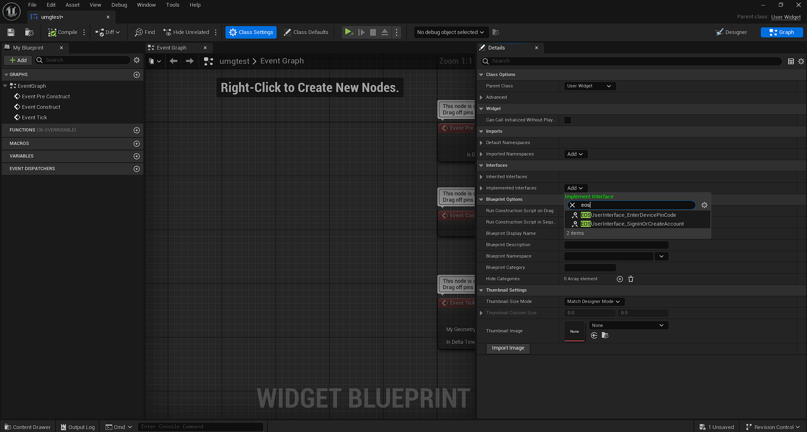
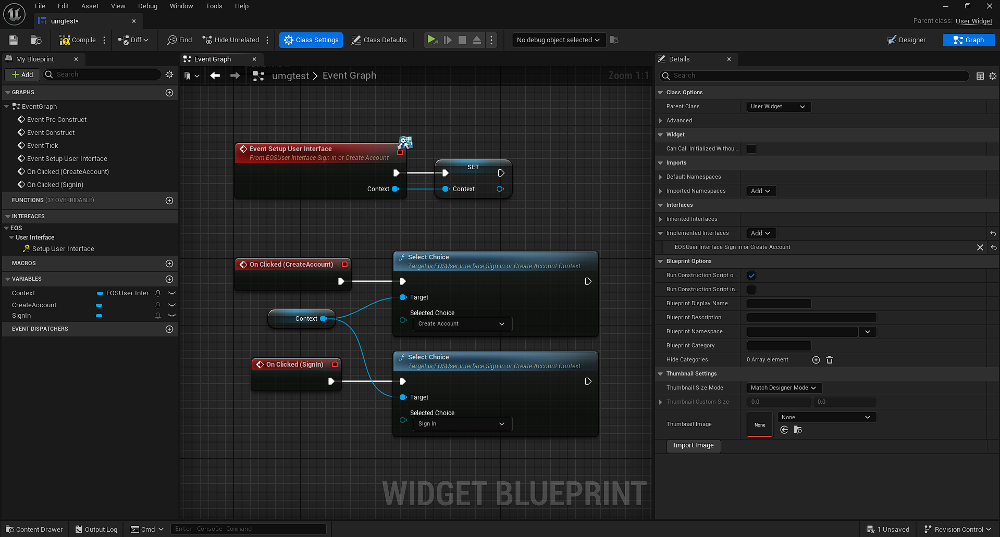
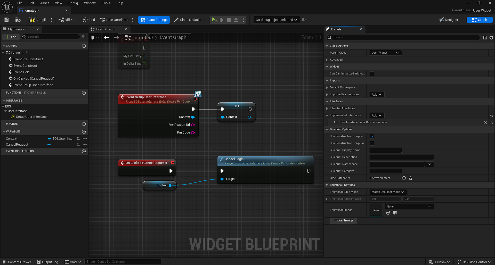
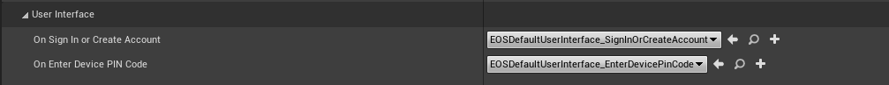
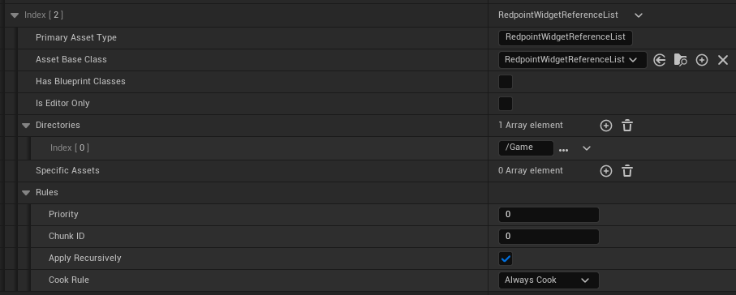
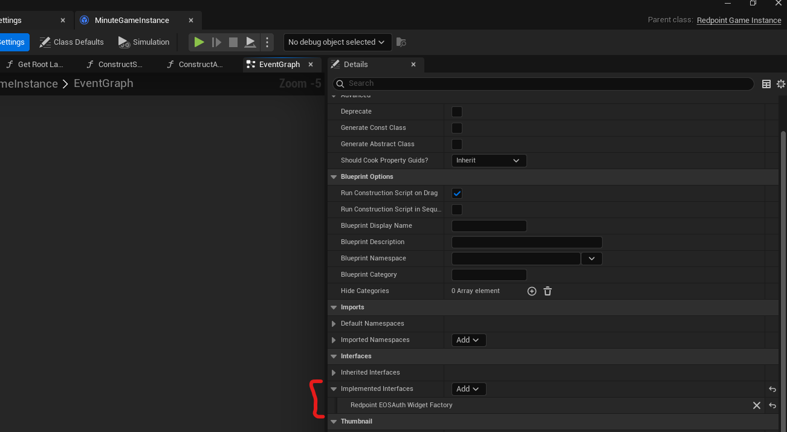
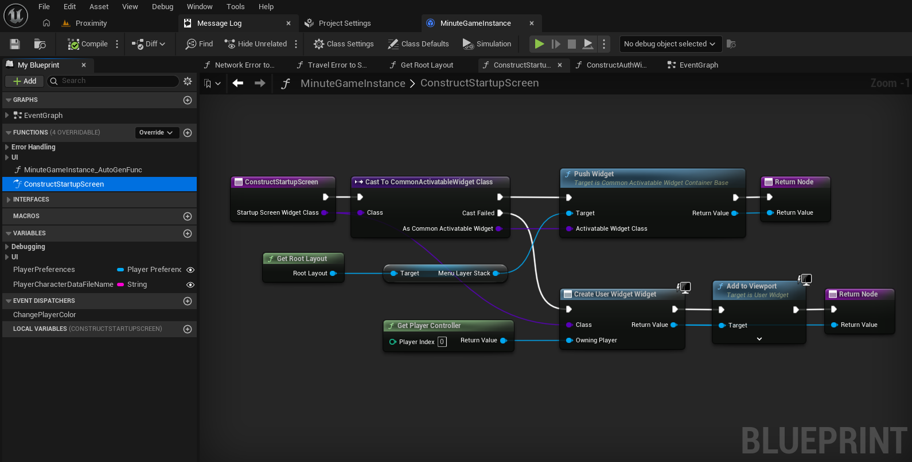

import Video from "@site/src/Video";

import videoCreateReferencesAsset from "./custom_ui/create_references_asset.mp4";
import videoSetupReferencesAsset from "./custom_ui/setup_references_asset.mp4";

The authentication system may need to prompt the player in certain scenarios, to confirm how the player wants to log into their account.

There are two ways to customize the login system:

- Customizing the UMG widgets to change the appearance of the prompts.
- Implementing the `IRedpointEOSAuthWidgetFactory` interface on your game instance to customize how widgets are displayed. This is essential for VR games which will need to attach widgets to actors instead of the viewport, but can also be used by games that want to push widgets onto a Common UI activatable widget stack.

## Customizing the login appearance

The default user interface prompts that the plugin ships with are built in Slate and C++. This ensures there aren't Asset Manager configuration requirements imposed on developers, which would otherwise conflict with a subset of projects.

To customize the login appearance, you can create your own UMG widgets and configure them to implement the `EOSUserInterface_EnterDevicePinCode` or `EOSUserInterface_SignInOrCreateAccount` interfaces.

### Implementing the interfaces

To implement one of the UI interfaces in your own UMG widget, you need to switch to the "Graph" tab, then click "Class Settings". The "Details" pane, which might be small and in the bottom-left of the screen, should switch to showing class settings. It's recommended to drag the "Details" pane out to the right-hand side of the screen to make it easier to change settings.

With the "Details" pane open, add one of the interfaces to the "Implemented Interfaces" section:

You should only implement one interface, as you should have a unique user interface for each type of prompt.

### Handling "Sign In or Create Account" interface

The "Sign In or Create Account" prompt is used when cross-platform accounts are optional, and a new player is playing the game. In this case, the player could be in two states:

- They've never played the game on any device before, and they want to create a new account tied to the local platform (e.g. Steam) that they're playing on, or
- They've played the game on another platform (e.g. Xbox), have [linked their cross-platform account](/ossv1/identity/linking.mdx) on that device, and are now playing on a new platform (e.g. Steam) and want to sign into their cross-platform account to bring their existing save data across.

This choice can not be automated. If you were to automatically pick "Create Account" for a player, they would end up with two accounts. In the example above, they'd end up with one tied to Xbox and their cross-platform account, and one tied to Steam.

To implement this interface, store the context from "Setup User Interface" in a variable. When the user clicks on the "Sign In" or "Create Account" buttons, call the "Select Choice" blueprint with the enumeration set based on what kind of button they clicked on.

### Handling "Enter Device PIN Code" interface

The "Enter Device PIN Code" prompt is used on console platforms when players are signing in or linking an Epic Games account. Console platforms do not have a web browser to direct players to, so instead players are provided a URL and a PIN code, and they need to open the URL on another device (such as a phone or computer) and enter the PIN code to link their Epic Games account to their local platform account on the console.

To implement this interface, store the context from "Setup User Interface" in a variable, along with the "Verification Url" and "Pin Code". You should display the both the URL as the URL the player should open on their other device, and the PIN code as the code they should enter.

### Update the configuration

Once you have got a copy of the widgets in your project, you can change which widgets are used in your game by changing Project Settings:

### Including the widgets in your project cook

To ensure your custom widgets are included when your game is cooked and packaged, you should create a new "Redpoint Widget Reference List" data asset in your project:

<Video url={videoCreateReferencesAsset} />

Open the newly created asset, and add your custom widgets to the list. Then, if this is the first time you are setting up a widget reference list in your project, click the "Register 'Redpoint Widget Reference List' assets with Asset Manager" button:

<Video url={videoSetupReferencesAsset} />

:::warning
If you don't set up a reference list asset, then your UMG widgets may not be cooked at runtime. If this is the case, login can fail if the plugin needs to prompt the player.
:::

If you want to add the Redpoint Widget Reference List assets to the Asset Manager manually, or if the button in the asset does not work for you, these are the settings you need:

## Customizing how widgets are displayed

The plugin allows you to override how authentication widgets are created, displayed and destroyed by implementing the `IRedpointEOSAuthWidgetFactory` interface on your game instance. In blueprints, you can do this by selecting "Class Settings" in the toolbar, and then clicking "Add" next to "Implemented Interfaces":

There is one function available to override, and two events:

- `ConstructStartupScreen`: This should construct the widget and return it.
- `PresentStartupScreen`: This should add the widget to the viewport and focus it.
- `DestructStartupScreen`: This should remove the widget from the viewport.

For example, in Minute of Mayhem we implement the `ConstructStartupScreen` function like so:

:::caution
VR games will need to bind to these events, and attach the widgets to the actors in the scene. Otherwise, your players will not be able to interact with the login prompts.
:::
