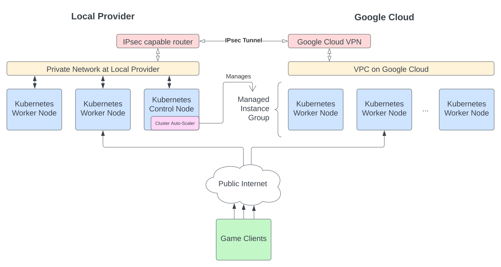

When setting up your regions, you'll want to enable bursting into cloud in at least one of them. This ensures that if you get more players than you planned for, your dedicated server infrastructure can automatically scale beyond the fixed capacity you have at local providers.

At the time of writing, Google Cloud is the cheapest public cloud available. While it's still more expensive than local providers, it's cheaper than other public clouds. Therefore, this document will guide you through the process of bursting into Google Cloud. You should choose a region for the local provider that is also serviced by Google Cloud.

Your local provider must support having a separate private network for your Kubernetes nodes, and they must be able to set up a site-to-site IPsec VPN. This will enable the Kubernetes nodes at your local provider and the Kubernetes nodes in Google Cloud to securely communicate over the private network.

## Cloud bursting design overview

To understand how we're going to connect a local provider and Google Cloud into a single private network, refer to the design diagram below.



## Setting up network connectivity

Before we can dynamically create Kubernetes nodes on Google Cloud in response to demand, we have to connect the private network at the local provider with the VPC on Google Cloud. This ensures that dedicated servers and Google Cloud virtual machines can fully communicate with each other.

### Creating a Cloud VPN on Google Cloud

This step assumes you've already created a Google Cloud account and project, and you have the Compute Engine API enabled.

1. Open the [Google Cloud VPN](https://console.cloud.google.com/hybrid/vpn/list) page in the Google Cloud Console.
1. Click **Create VPN Connection**.
1. When prompted, choose Classic VPN. The only traffic that will be running over the VPN is Kubernetes API calls (not game traffic), so unless you have a specific reason to set up a high-availability connection, it's typically not needed.
1. Give the new VPN a name, like `west-europe`.
1. Select the VPC network that you will be running Google Cloud virtual machines in. Typically this will be `default`.
1. Select the region that you will be running Google Cloud virtual machines in.
1. Select the IP address to use for the VPN. You'll probably need to click **Create IP Address** to create one.
1. Under the tunnel settings:
    - Give the tunnel an appropriate name, like `west-europe-tunnel-1`.
    - Set the remote peer IP address to the IP address of the router at the local provider. Even if you haven't set up the IPsec tunnel at the local provider yet, you'll need to provide the IP address here.
    - For IKE version, leave it as `IKEv2`, unless your local provider only supports `IKEv1`.
    - Click **Generate and copy** to generate a pre-shared key. Save this somewhere safe as you'll need to set up the VPN on the local provider end.
    - Select **Route-based** as the routing option.
    - Enter the private network subnet as the remote network IP range.
1. Click **Create**.
1. You'll now need to wait for the VPN to be created on Google Cloud.
1. Next to the newly created VPN, click on `default` (the name of the VPC network).
1. In the subnets list, locate the region that you're deploying machines into, and note down the `IP address ranges`. These are the remote subnets you'll provide when setting up the tunnel at the local provider.

### Creating an IPsec tunnel at your local provider

These steps will be highly dependent on the local provider you are using. You might have to contact their support staff to get an IPsec tunnel set up for your private network.

However, important information you'll need to provide them is:

- **VPN Protocol:** IPsec (IKEv2)
- **Pre-shared key:** The key you generated on Google Cloud.
- **Public IP address:** The remote peer IP address you provided to Google Cloud; this will be determined by the local provider.
- **Remote subnets:** The IP address range for the VPC subnet that you are deploying Google Cloud virtual machines into.

### Ensuring the IPsec tunnel is established

Once you've set up the IPsec tunnel at your local provider, you should be able to check the status of the Cloud VPN instance on Google Cloud:

1. Open the [Google Cloud VPN](https://console.cloud.google.com/hybrid/vpn/list) page in the Google Cloud Console.
1. Click on the name of the VPN you just set up.
1. Under **VPN tunnels**, you should see the tunnel you configured in an `Established` status, with a green check next to it.

### Adding a firewall rule in Google Cloud

To permit all network traffic from the local provider into Google Cloud, you need to add a firewall rule. By default without it, ICMP (ping) traffic will work, but UDP and TCP traffic will be blocked, which will cause the network tests to fail.

1. Open the [Firewall](https://console.cloud.google.com/networking/firewalls/list) page in the Google Cloud Console.
1. Click **Create Firewall Rule**.
1. Give it a name like `allow-from-tunnel`.
1. Set the VPC network if you're using something non-standard, otherwise leave it as `default`.
1. Set the targets to "All instances in the network".
1. Set the source filter to the remote subnet at the local provider; this is the same value you set for "IP address ranges" when creating the Google Cloud VPN.
1. For protocols and ports select "Allow all".
1. Click **Create**.

### Testing ICMP network connectivity

To test that we can actually send network traffic between our local provider and Google Cloud, we'll test that `ping` works between two machines. Since you don't have any virtual machines in Google Cloud, you'll first need to create one:

1. Open the [Compute Engine](https://console.cloud.google.com/compute/instances) page in the Google Cloud Console.
1. Click **Create Instance**, and give it a name like `test-instance`.
1. For the region, pick the same region you configured the Google Cloud VPN for. The zone can be any of the available zones.
1. For the machine type, choose an option based on what's suitable:
    - If you're just planning on doing the ping test now, and plan to do the Kubernetes join test below later, use an `e2-micro` instance size.
    - If you plan on doing this ping test and the Kubernetes join test below immediately after one another, pick a larger instance like `e2-medium`.
1. Under boot disk, click **Change** and select Ubuntu 20.04 LTS as the operating system.
1. Leave all the other options as the default, and click **Create**.
1. Wait for the instance to be created on Google Cloud.

Then, to perform the ping test:

1. On the Google Cloud instance, run `ping <private IP>`, replacing the private IP with the private IP address of the dedicated server at the local provider.
1. On the dedicated server at the local provider, run `ping <internal IP>` where the internal IP is the internal IP address of the Google Cloud virtual machine (this is shown under the "Internal IP" column).
1. Verify that both machines can successfully ping each other. You should see output similar to the following on each machine:

```
64 bytes from ___.___.___.___: icmp_seq=1 ttl=60 time=3.00ms
64 bytes from ___.___.___.___: icmp_seq=2 ttl=60 time=3.00ms
```

If both machines show this output, then basic network connectivity over the VPN is working.

If you don't plan on proceeding to test Kubernetes network connectivity right now, delete the `e2-micro` instance in the Google Cloud Console.

:::info
If ICMP network connectivity is not working, make sure that the firewall at the local provider permits traffic between the Google Cloud subnet and the local provider's private subnet. Google Cloud already configures the firewall to allow ICMP traffic between the two networks, so the only firewall that can block the ICMP traffic is the one at the local provider.
:::

### Testing UDP network connectivity

To test that we can send more than just ICMP ping packets, we'll use the `hping3` utility. On both the dedicated server and the Google Cloud virtual machine, run the following command:

```bash
apt-get update && apt-get install -y hping3
```

Then, assuming the IP address at the local provider is `10.0.0.1` and the IP address on Google Cloud is `10.192.0.3`, run the following command on the local provider:

```bash
hping3 10.192.0.3 --udp -p 10234 -d 100 --sign hello
```

And run the following command on Google Cloud (replace `ens4` with the interface name on Google Cloud; you can f):

```bash
hping3 --listen hello 10.0.0.1 -I ens4
```

If this works, you should see the following output on Google Cloud:

```
hping3 listen mode
[main] memlockall(): Operation not supported
Warning: can't disable memory paging!
XXXXXXXXXXXXXXXXXXXXXXXXXXXXXXXXXXXXXXXXXXXXXXXXXXXXXXXXXXXXXXXXXXXXXXXXXXXXXXXXXXXXXXXXXXXXXXXXXXXXXXXXXXXXXXXXXXXXXXXXXXXXXXXXXXXXXXXXXXXXXXXXXXXXXXXXXXXXXXXXXXXXXXXXXXXXXXXXXXXXXXXXXXXXXXXXXXXXXXXXXXXXXXXXXXXXXXXXXXXXXXXXXXXXXXXXXXXXXXXXXXXXXXXXXXXXXXXXXXXXXXXXXXXXXXXXXXXXXXXXXXXXXXXXXXXXXXXXXXXXXXXXXXXXXXXXXXXXXXXXXXXXXXXXXXXXXXXXXXXXXXXXXXXXXXXXXXXXXXXXXXXXXXXXXXXXXXXXXXXXXXXXXXXXXXXXXXXXXXXXXXXXXXXXXXXXXXXXXXXXXXXXXXXXXXXXXXXXXXXXXXXXXXXXXXXXXXXXXXXXXXXXXXXXXXXXXXXXXXXXXXXXXXXXXXXXXXXXXXXXXXXXXXXXXXXXXXXXXXXXXXXXXXXXXXXXXXXXXXXXXXXXXXXXXXXXXXXXXXXXXXXXXXXXXX
```

And after hitting `Ctrl-C` on the local provider, you should see something like this:

```
HPING 10.192.0.3 (eth0 10.192.0.3): udp mode set, 28 headers + 100 data bytes
[main] memlockall(): Operation not supported
Warning: can't disable memory paging!
ICMP Port Unreachable from ip=10.192.0.3 name=UNKNOWN
status=0 port=1064 seq=0
ICMP Port Unreachable from ip=10.192.0.3 name=UNKNOWN
status=0 port=1065 seq=1
ICMP Port Unreachable from ip=10.192.0.3 name=UNKNOWN
status=0 port=1066 seq=2
^C
--- 10.192.0.3 hping statistic ---
3 packets transmitted, 3 packets received, 0% packet loss
round-trip min/avg/max = 7.5/11.2/18.6 ms
```

:::caution
If you don't see `XXXXX` on the Google Cloud side, or you don't see `0% packet loss` on the local provider side, then UDP connectivity is not working. Ensure that you've configured the firewall on Google Cloud and the local provider to permit all traffic between the two network subnets.
:::

Ensure that it works in the other direction by running the following command on Google Cloud:

```bash
hping3 10.0.0.1 --udp -p 10234 -d 100 --sign hello
```

And the following command on the local provider (replace `eth0` with the private interface name; you can find this with `ifconfig`):

```bash
hping3 10.192.0.3 --listen hello -I eth0
```

You should see `XXXXX` output on the local provider this time, and `0% packet loss` outputted on Google Cloud.

### Testing Kubernetes network connectivity

Now that we've verified machines on each end can successfully send ICMP and UDP data to each other, we want to ensure that network connectivity within the Kubernetes cluster is fully working. This involves checking that an Ubuntu container running at the local provider can communicate with an Ubuntu container on Google Cloud.

Although we don't plan to have much container-to-container traffic at the game server level, it's still required for the internal parts of Agones and Kubernetes to work correctly. If ICMP and UDP network connectivity works, but something is wrong with Kubernetes network connectivity internally, it can be very difficult to identify and track down the cause unless you're aware that it is the Kubernetes-level networking that is broken. Therefore, these steps are designed to help you catch this issue early to save debugging time later.

We're going to join a Google Cloud machine to the Kubernetes cluster running at the local provider, so it's important to note the following:

- You should not be using the cluster in production when running this test. If you are, Agones might schedule game servers on the new Google Cloud machine, and if networking isn't fully working, it can prevent players from connecting to game servers.
- The Google Cloud machine should be at least an `e2-medium` to ensure sufficient CPU and memory resources for k3s. If you started with an `e2-micro`, delete it now and create a new `e2-medium` instance.

#### Joining the Kubernetes cluster

On the Kubernetes control node at the local provider, run the following command to get the node token. This is the same token you used during [Adding nodes to the cluster](/dedis/adding_nodes.mdx):

```bash
cat /var/lib/rancher/k3s/server/node-token
```

In addition, you'll need the private IP address of the Kubernetes control node. In [Creating your cluster](/dedis/creating_your_cluster.mdx), this was `10.0.0.1` in the examples provided.

On the Google Cloud instance, run the following command. Make sure you set the following values, replacing the examples provided:

- `INSTALL_K3S_VERSION`: This should match the version when you installed K3S on the control node.
- `K3S_URL`: This should be `https://...:6443`, replacing `...` with the private IP address of the control node.
- `K3S_TOKEN`: This should be set to the token you copied from the control node.

```bash
curl -sfL https://get.k3s.io | INSTALL_K3S_VERSION=v1.22.7+k3s1 K3S_URL=https://10.0.0.1:6443 K3S_TOKEN=K10...cf6 sh -
```

:::caution
In this test, we're starting the k3s-agent straight away. This leads to the Kubernetes test node not having the correct public IP address in Kubernetes. However, since we're only testing connectivity over the private network, we don't need it to be correct right now.

Later on when we're setting up the managed instance group on Google Cloud, we'll fetch the public IP address from the metadata server so that it is correct when the `k3s-agent` is installed.
:::

After a few moments, you should see the Google Cloud virtual machine appear in `kubectl get nodes` on the Kubernetes control node:

```
NAME             STATUS   ROLES                  AGE    VERSION
west-europe-03   Ready    <none>                 150d   v1.22.7+k3s1
west-europe-02   Ready    <none>                 150d   v1.22.7+k3s1
instance-2       Ready    <none>                 3m9s   v1.22.7+k3s1
west-europe-01   Ready    control-plane,master   159d   v1.22.7+k3s1
```

#### Creating the test pods

When we're creating our test pods, we want to ensure Kubernetes places them on specific machines. This means we can't just use `kubectl run` because we need to define node affinity.

Create a file with the following contents on your local machine. This assumes you've followed the instructions in [Setting up autoscaling](/dedis/setting_up_autoscaling.mdx) to open the required firewall ports. If you haven't, create this file on the Kubernetes control node instead.

```yaml
apiVersion: v1
kind: Pod
metadata:
  name: test-gce
  labels:
    app: test-gce
spec:
  # This should be set to the node name of the Google Cloud virtual machine,
  # as it was shown in `kubectl get nodes`.
  nodeName: instance-2
  containers:
  # This container serves traffic on port 80.
  - name: nginx
    image: nginx:1.14.2
    ports:
    - containerPort: 80
  # This container is where we'll interactively run 'curl' to test from.
  - name: ubuntu
    image: ubuntu:20.04
    command: [ "/bin/bash", "-c", "--" ]
    args: [ "while true; do sleep 30; done;" ]
---
# This service exposes the test-gce pod's port as a service we should be
# able to reach from the test-dedi container.
apiVersion: v1
kind: Service
metadata:
  name: test-gce
spec:
  selector:
    app: test-gce
  ports:
    - protocol: TCP
      port: 80
      targetPort: 80
---
apiVersion: v1
kind: Pod
metadata:
  name: test-dedi
  labels:
    app: test-dedi
spec:
  # This should be set to the node name of any dedicated server you have
  # at the local provider, as was shown in `kubectl get nodes`.
  nodeName: hulk-kube
  containers:
  # This container serves traffic on port 80.
  - name: nginx
    image: nginx:1.14.2
    ports:
    - containerPort: 80
  # This container is where we'll interactively run 'curl' to test from.
  - name: ubuntu
    image: ubuntu:20.04
    command: [ "/bin/bash", "-c", "--" ]
    args: [ "while true; do sleep 30; done;" ]
---
# This service exposes the test-dedi pod's port as a service we should be
# able to reach from the test-gce container.
apiVersion: v1
kind: Service
metadata:
  name: test-dedi
spec:
  selector:
    app: test-dedi
  ports:
    - protocol: TCP
      port: 80
      targetPort: 80
```

Then, create the pods by running:

```
kubectl create -f pods.yaml
```

You should then be able to see the pods started if you run `kubectl get pods`:

```
NAME                                    READY   STATUS      RESTARTS   AGE
test-dedi                               2/2     Running     0          105s
test-gce                                2/2     Running     0          105s
```

#### Testing HTTP connectivity between the pods

Before we can use curl, we need to install it into the Ubuntu containers. Run the following commands:

```bash
kubectl exec -c ubuntu test-dedi -- bash -c 'apt-get update && apt-get install -y curl'
kubectl exec -c ubuntu test-gce -- bash -c 'apt-get update && apt-get install -y curl'
```

:::info
These commands might already reveal that Kubernetes network connectivity is broken. If you see output like:

```
Err:1 http://security.ubuntu.com/ubuntu focal-security InRelease
  Temporary failure resolving 'security.ubuntu.com'
Err:2 http://archive.ubuntu.com/ubuntu focal InRelease
  Temporary failure resolving 'archive.ubuntu.com'
```

then pods running on Google Cloud can't reach the DNS server running on the control node at the local provider. This indicates UDP connectivity is broken and that you haven't configured the firewalls properly. Double-check your results in [Testing UDP network connectivity](#testing-udp-network-connectivity).
:::

To test connectivity from the local provider to Google Cloud, run the following command:

```
kubectl exec -c ubuntu test-dedi -- bash -c 'curl http://test-gce/'
```

To test connectivity from Google Cloud to the local provider, run the following command:

```
kubectl exec -c ubuntu test-gce -- bash -c 'curl http://test-dedi/'
```

Both commands should give you output like the following:

```
<!DOCTYPE html>
<html>
<head>
<title>Welcome to nginx!</title>
<style>
    body {
        width: 35em;
        margin: 0 auto;
        font-family: Tahoma, Verdana, Arial, sans-serif;
    }
</style>
</head>
<body>
<h1>Welcome to nginx!</h1>
<p>If you see this page, the nginx web server is successfully installed and
working. Further configuration is required.</p>

<p>For online documentation and support please refer to
<a href="http://nginx.org/">nginx.org</a>.<br/>
Commercial support is available at
<a href="http://nginx.com/">nginx.com</a>.</p>

<p><em>Thank you for using nginx.</em></p>
</body>
</html>
```

If you see this output, then network connectivity is fully working between Google Cloud and the local provider, and you can proceed to installing the cluster autoscaler.

You can now delete the Google Cloud virtual machine you were using for testing. To remove the deleted Google Cloud node from Kubernetes run:

```
kubectl delete node instance-2
```

:::danger
Do not proceed if you don't have the ICMP, UDP and Kubernetes network connectivity tests all passing. If network connectivity is partially broken, it can result in hard to diagnose connectivity issues later on.
:::

## Preparing to install the cluster autoscaler

Before we can install the cluster autoscaler, we need to create the instance group it will operate on, and set up some permissions and secrets for it.

### Create the instance template for your Google Cloud virtual machines

In Google Cloud, setting up a managed instance group requires defining an instance template. This tells the managed instance group what kind of virtual machines to launch: their size, their operating system and any startup and shutdown scripts.

1. Open the [Instance templates](https://console.cloud.google.com/compute/instanceTemplates/list) page in the Google Cloud Console.
1. Click **Create instance template**.
1. Set an appropriate name for the instance template. You can't edit instance templates later, so you should suffix this with a version like `game-server-template-01`.
1. Choose an appropriate machine for the virtual machine. Please note the following requirements:
    - The machine type you select should be an `e2-standard-2` or larger. Do not select the shared core machine types.
    - The machine type should have enough CPU and memory to run several game server containers, based on the `resources` you set when defining your game server fleet. For example, if your game server container requires 1 vCPU and 1GB of RAM, you can pick an `e2-standard-2` instance, but you'll probably only get one scheduled per virtual machine, as the overhead of k3s means you won't have the full 2 vCPUs available for usage. You might be better of picking an `e2-highcpu-4` in that scenario.

:::danger
If you don't pick a machine type large enough, the cluster autoscaler will scale up the instance group but be unable to schedule game server containers on it. This will lead to a "runaway scheduling" scenario where it will keep trying to scale up the cluster and create more virtual machines, without actually making any progress. In the end, this will cause the managed instance group to sit close to its maximum size, without being utilized. This will cost you a lot of money, so make sure you set the machine type large enough to avoid this scenario.
:::

5. Under "Boot disk", click **Change**.
1. Select "Ubuntu" as the operating system, and "Ubuntu 20.04 LTS" as the version. If your packaged game server is quite large, you should also increase the "Boot disk size". Then click **Select**.
1. Expand the **Networking, Disks, Security, Management, Sole-Tenancy** section.
1. Expand the **Management** section.
1. Set the "Automation - Startup script" to the following script. Replace the values at the top as appropriate for your cluster and region:
```bash
#!/bin/bash
# Replace these values for your cluster.
export INSTALL_K3S_VERSION=v1.22.7+k3s1
export K3S_URL=https://...:6443
export K3S_TOKEN=K101...00f

# Install k3s and join the VM to the cluster.
curl -sfL https://get.k3s.io | INSTALL_K3S_SKIP_START=true sh -
PROJECT_ID=$(curl http://metadata.google.internal/computeMetadata/v1/project/project-id -H "Metadata-Flavor: Google")
INSTANCE_NAME=$(curl http://metadata.google.internal/computeMetadata/v1/instance/name -H "Metadata-Flavor: Google")
INSTANCE_PRIVATE_IP=$(curl http://metadata.google.internal/computeMetadata/v1/instance/network-interfaces/0/ip -H "Metadata-Flavor: Google")
INSTANCE_PUBLIC_IP=$(curl http://metadata.google.internal/computeMetadata/v1/instance/network-interfaces/0/access-configs/0/external-ip -H "Metadata-Flavor: Google")
INSTANCE_ZONE_FULL=$(curl http://metadata.google.internal/computeMetadata/v1/instance/zone -H "Metadata-Flavor: Google")
OLDIFS=$IFS
IFS=/
ARR=($INSTANCE_ZONE_FULL)
INSTANCE_ZONE=${ARR[3]}
IFS=$OLDIFS
mkdir /etc/systemd/system/k3s-agent.service.d || true
cat >/shutdown-node.sh <<EOF
#!/bin/bash
INSTANCE_NAME=$(curl http://metadata.google.internal/computeMetadata/v1/instance/name -H "Metadata-Flavor: Google")
export KUBECONFIG=/var/lib/rancher/k3s/agent/kubelet.kubeconfig
kubectl get nodes
kubectl delete node "$INSTANCE_NAME"
/usr/local/bin/k3s-agent-uninstall.sh
EOF
chmod u+x /shutdown-node.sh
cat >/etc/systemd/system/k3s-agent.service.d/override.conf <<EOF
[Service]
ExecStart=
ExecStart=/usr/local/bin/k3s \
    agent \
    --kubelet-arg provider-id=gce://$PROJECT_ID/$INSTANCE_ZONE/$INSTANCE_NAME \
    --node-name $INSTANCE_NAME \
    --node-ip $INSTANCE_PRIVATE_IP \
    --node-external-ip $INSTANCE_PUBLIC_IP
ExecStop=/shutdown-node.sh
EOF
systemctl daemon-reload
systemctl start k3s-agent
```
10. At the bottom of the page, click **Create**.

### Create the managed instance group in Google Cloud

After the instance group has been created on Google Cloud, it's time to create the managed instance group. This is the group that will contain the virtual machines, and is what the cluster autoscaler tells to scale up or down based on the demand inside your Kubernetes cluster.

1. Open the [Instance groups](https://console.cloud.google.com/compute/instanceGroups/list) page in the Google Cloud Console.
1. Click **Create instance group**.
1. Set the name of the instance group to something like `west-europe-01`.
1. Set the instance template to the template you just created.
1. Set the region and zone to the Google Cloud zone you want to deploy instances into. This should be the same zone that you connected the IPsec tunnel to.
1. **Set the auto-scaling mode to Off**. This setting controls the Google Cloud autoscaler, which is not what we want to be using. We plan on using the cluster autoscaler, which we'll install into Kubernetes soon. To prevent the different autoscalers conflicting with one another, make sure this autoscaler is turned off.
1. Back up the page, set **Number of instances** to 0. We don't want to create any instances on Google Cloud until our cluster autoscaler is installed later.
1. Click **Create** at the bottom of the page.

### Grant the kubelet service account permission to delete nodes

While the cluster autoscaler will delete the Google Cloud virtual machines when scaling down, it won't delete the Kubernetes node objects that appear when you do `kubectl get nodes`. Instead, the nodes will sit there in the `NotReady` status forever until they're manually cleaned up.

To avoid this, we've set an `ExecStop=` override during the startup script on the instance template above, which will use the kubelet's service account to delete the Kubernetes node object when the virtual machine is shutting down. However, the kubelet service account doesn't have permission to delete nodes by default, so we need to create a RBAC policy to grant it permission.

In a file on your local machine, define a new RBAC policy like so:

```yaml
apiVersion: rbac.authorization.k8s.io/v1
kind: ClusterRole
metadata:
  name: kubelet-self-delete
rules:
- apiGroups:
  - ""
  resources:
  - nodes
  verbs:
  - delete
---
apiVersion: rbac.authorization.k8s.io/v1
kind: ClusterRoleBinding
metadata:
  name: kubelet-self-delete
roleRef:
  apiGroup: rbac.authorization.k8s.io
  kind: ClusterRole
  name: kubelet-self-delete
subjects:
- apiGroup: rbac.authorization.k8s.io
  kind: Group
  name: system:nodes
```

Then, apply the policies to your Kubernetes cluster:

```bash
kubectl apply -f path/to/rbac.yaml
```

### Create the autoscaler configuration file, and a Google Cloud service account

In order for the cluster autoscaler to work, it needs a configuration file that specifies the Google Cloud zone to operate in, and a Google Cloud service account so it has permission to manage the virtual machines.

#### Create the service account

First, create a new Google Cloud service account, assign it the correct permissions, and download the JSON key:

- Open the [Service accounts](https://console.cloud.google.com/iam-admin/serviceaccounts) page in the Google Cloud Console.
- Click **Create Service Account**.
- Call it "cluster-autoscaler".
- Click **Create and Continue**.
- Select "Compute Admin" as the role.
- Click **Done**.
- Click the vertical **...**.
- Click **Manage keys**.
- Click **Add key -> Create new key**.
- Click **Create** with JSON selected.
- Click **Close**.

Make a note of the full path to the downloaded JSON file.

#### Create the autoscaler configuration file

On your local machine somewhere, create a file called `gcfg.ini` with the following contents. Replace the `your-google-cloud-project` with your actual project ID and `australia-southeast2-a` with the zone you're deploying virtual machines into.

```ini
[global]
project-id=your-google-cloud-project
regional=false
local-zone=australia-southeast2-a
```

#### Store both as a Kubernetes secret

With both the downloaded JSON and the created `gcfg.ini` file, store them as a secret in the Kubernetes cluster. Replace `path/to/downloaded/project-b36591a36d34.json` with the path to the downloaded JSON file and `path/to/gcfg.ini` with the path to the `gcfg.ini` file you created:

```bash
kubectl create secret generic gce-autoscaler-info --from-file=google-application-credentials.json=path/to/downloaded/project-b36591a36d34.json,gcfg.ini=path/to/gcfg.ini
```

### Permit inbound access to game servers on Google Cloud

Previously we added a firewall rule to Google Cloud to allow traffic over the IPsec tunnel. Now we need to add a firewall rule to permit game clients to connect to the game server containers over the Internet:

1. Open the [Firewall](https://console.cloud.google.com/networking/firewalls/list) page in Google Cloud Console.
1. Click **Create firewall rule**.
1. Set the name to `allow-connections-to-game-servers`.
1. Set the targets to "All instances in the network".
1. Add the range `0.0.0.0/0` to the source IPv4 ranges (this is "the Internet").
1. Under "Specified protocols and ports", tick "UDP".
1. Set the UDP range to 7000-8000. This is the default range that Agones uses.
1. Click **Create**.
 
## Install the cluster autoscaler

We're now ready to install the cluster autoscaler. Run the following commands in order, replacing the values:

- `your-google-cloud-project` should be replaced with your project ID. It must be the same as the value you set in `gcfg.ini`.
- `australia-southeast2-a` should be the zone you are deploying virtual machines into. It must be the same as the value you set in `gcfg.ini` and must be the same zone that you configured the Google Cloud VPN for.
- `west-europe-01` should be replaced with the name of the managed instance group you created previously.
- Adjust the minimum size and maximum size to suit your deployment.

```bash
# Add the autoscaler repository to Helm.
helm repo add autoscaler https://kubernetes.github.io/autoscaler

# Set the Google Cloud project ID.
PROJECTID=your-google-cloud-project
# Set the zone that you created the instance group in.
ZONENAME=australia-southeast2-a
# Set the name of the instance group you previously created.
GROUPNAME=west-europe-01
# Set the minimum number of nodes that the autoscaler should autoscale to.
MINSIZE=0
# Set the maximum number of nodes that the autoscaler should autoscale to.
MAXSIZE=10

# Install the autoscaler.
helm install gce-autoscaler autoscaler/cluster-autoscaler \
  --set autoscalingGroups[0].name=https://content.googleapis.com/compute/v1/projects/$PROJECTID/zones/$ZONENAME/instanceGroups/$GROUPNAME,autoscalingGroups[0].maxSize=$MAXSIZE,autoscalingGroups[0].minSize=$MINSIZE \
  --set image.repository=registry.redpoint.games/redpointgames/kubernetes-autoscaler \
  --set image.tag=latest \
  --set image.pullPolicy=Always \
  --set cloudProvider=gce \
  --set extraEnv.GOOGLE_APPLICATION_CREDENTIALS=/secret/google-application-credentials.json \
  --set extraVolumeSecrets.gce-autoscaler-info.name=gce-autoscaler-info \
  --set extraVolumeSecrets.gce-autoscaler-info.mountPath=/secret/ \
  --set extraArgs.cloud-config=/secret/gcfg.ini \
  --set extraArgs.scale-down-unneeded-time=3m \
  --set extraArgs.scale-down-delay-after-add=3m \
  --set nodeSelector."node-role.kubernetes.io/control-plane"=true
```

:::note
You might notice we're using the `registry.redpoint.games/redpointgames/kubernetes-autoscaler` image above. We've had to patch the Kubernetes Autoscaler so that it can work with mixed clusters (bare metal + cloud). You can [view the changes we've made to the cluster autoscaler on GitLab](https://src.redpoint.games/redpointgames/kubernetes-autoscaler).
:::

## Testing the cluster autoscaler

To test that the cluster autoscaler works, we'll first cordon any bare metal nodes we have running in the cluster (except the control node). This will prevent the game server fleet from using any of the bare metal nodes for scheduling while we do this test.

Get the list of nodes with `kubectl get nodes`:

```
NAME             STATUS   ROLES                  AGE   VERSION
west-europe-01   Ready    control-plane,master   97m   v1.22.7+k3s1
west-europe-02   Ready    <none>                 32m   v1.22.7+k3s1
west-europe-03   Ready    <none>                 48s   v1.22.7+k3s1
```

Then cordon all of them except the control node:

```bash
kubectl cordon west-europe-02 west-europe-03
```

If you have a game server fleet and a game server fleet autoscaler deployed, make sure you delete the fleet autoscaler first. For example:

```bash
kubectl get fleetautoscaler
kubectl delete fleetautoscaler ...
```

Then scale up an existing game server fleet beyond the capacity of the control node. For example:

```bash
kubectl scale fleets --replicas=10 eos-dedicated-game-server
kubectl get gameservers
```

You should gradually increase the `--replicas=` count until you see game servers appear in the `Starting` status, instead of being immediately `Ready` on an existing node. This indicates the game servers need to be scheduled on a new node as there is no more capacity available.

You can view the cluster autoscaler logs by running:

```
kubectl --namespace=default get pods -l "app.kubernetes.io/name=gce-cluster-autoscaler,app.kubernetes.io/instance=gce-autoscaler"
kubectl logs -f (pod name shown from previous command...)
```

You should be able to see the cluster autoscaler scaling up the managed instance group in response to the lack of capacity. You should also be able to see the instances created in the Google Cloud Console when viewing the managed instance group.

After a minute or so, you should be able to see the provisioned node when running `kubectl get nodes` and a short time after that, you should be able to see the game servers move into the `Ready` status with `kubectl get gameservers`.

You can optionally test that you're able to connect to these game servers in your game client. `kubectl get gameservers` will show you the address and port to connect to.

Once you've verified that the game servers are provisioned correctly, scale the fleet back down again and re-create any fleet autoscaler you might have had:

```bash
kubectl scale fleets --replicas=... eos-dedicated-game-server
# If you've configured an autoscaler...
kubectl apply -f fleetautoscaler.yaml
```

Then, uncordon the bare metal nodes you previously cordoned:

```bash
kubectl uncordon west-europe-02 west-europe-03
```
