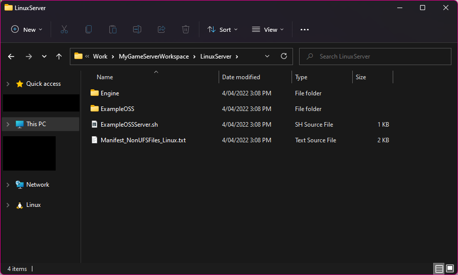

import KubernetesPullSecretGenerator from "@site/src/KubernetesPullSecretGenerator";

To deploy a dedicated server, you'll need to install extra tools in your development environment, and modify your game code so that your game server binaries will run correctly under the Agones/Kubernetes environment.

## Required development tools

To package a dedicated server for Linux, you'll need:

- Install the Linux cross-compilation tools.
- A source build of Unreal Engine. You can't package dedicated servers using the version of Unreal Engine you get from the Epic Games Launcher.

### Install the Linux cross-compilation tools

Follow the [installation guide](https://dev.epicgames.com/documentation/en-us/unreal-engine/linux-development-requirements-for-unreal-engine) on how to install the Linux cross-compilation tools for the engine version you are targeting.

### Targeting a source build of the engine

To use a source build of Unreal Engine, you'll need to:

1. Make sure you have [Visual Studio 2019 or 2022 installed](https://visualstudio.microsoft.com/vs/community/) with the Desktop C++ workload.
1. [Link your GitHub account with your Epic Games account](https://www.epicgames.com/account/connections).
1. Use Git to [clone the engine from GitHub](https://github.com/EpicGames/UnrealEngine/). You can do that from the command line with `git clone https://github.com/EpicGames/UnrealEngine/ UnrealEngine`, which will put it in a folder called "UnrealEngine".
1. Check out the engine version you want to use. This can be done from the command line with `git checkout 4.27`
1. Install the dependencies by running `Setup.bat`. You can just double-click it in the file explorer. This will take some time as it downloads all of the prerequisites the engine needs to build.
1. In your project's `Source` folder, create a server target using the file below as a base. If you don't have a `Source` folder, you'll need to add a C++ file to your project first through the editor (you can just make an empty actor, it doesn't actually matter what kind of C++ file you make). Replace `__MY_GAME__` with the name of your `.uproject` file without the extension.

```csharp
using UnrealBuildTool;
using System.Collections.Generic;

public class __MY_GAME__ServerTarget : TargetRules
{
    public __MY_GAME__ServerTarget(TargetInfo Target) : base(Target)
    {
        Type = TargetType.Server;
        DefaultBuildSettings = BuildSettingsVersion.V2;
        ExtraModuleNames.AddRange(new string[] { "__MY_GAME__" });
    }
}
```

7. Right-click on your `.uproject` file and click "Switch engine version". Click the "..." and navigate to the folder that Unreal Engine was downloaded to. This will make your project use the source build of the engine.
1. Open the generated `.sln` file in Visual Studio, and run the `Development Editor / Win64` target (this should be the default). This will build the engine which will take a while, and then launch the editor.
1. We'll cover packaging a dedicated server for Linux later in this document.

## Creating a client ID and secret for your game server binaries

You will have set up an EOS client ID and secret for your game client in the backend when you started using the EOS Online Framework plugin. You now need to create a separate client ID and secret for your game server binaries.

By having a different client ID and secret, we can grant the game server containers extra permissions that clients don't have. This can include things like permissions to modify stats, award achievements and create sessions in the sessions list.

To create and assign a separate client ID and secret:

- Open the [Epic Games Dev Portal](https://dev.epicgames.com/portal/) and locate your existing product.
- Under **Product Settings**, click the **Clients** tab.
- Click **Add New Client**.
- Set the client name to something like "Game Server".
- Under the client policy, click "Add new client policy".
- Set the client policy name to something like "Game Server".
- Set the client policy type to "TrustedServer". You can also set it to Custom and manually control the permissions, but TrustedServer is a good default for most games.
- Click **Save & Exit** on the new client policy screen.
- Click **Save & Exit** on the new client screen.
- Next to the new client you created, click the **...** dropdown and click on **Details**.
- Copy the value of the "Client ID" field and paste it into the "Dedicated Server Client Id" field under Project settings.
- Scroll down and copy the value of the "Secret key" field and paste it into the "Dedicated Server Client Secret" field under Project settings.

### Additional instructions for dual distribution mode

:::caution
This step is only required if the distribution mode is set to "Both developers and players will run dedicated servers" in Project Settings.
:::

This guide assumes your distribution mode is set to "Dedicated server binaries are only ever distributed and run by developers".

If it's set to "Both developers and players will run dedicated servers", you'll also need to pass the client ID and secret on the command line when defining your `GameServer` and `GameServerFleet` resources, as demonstrated below.

The `DedicatedServerPrivateKey` is the value of the "Dedicated Server Private Key" field in Project Settings, and you only need to provide it if "Trusted Dedicated Servers" is turned on.

```yaml
spec:
  imagePullSecrets:
    - name: gitlab
  containers:
    - name: eos-dedicated-server
      # the rest of the game server definition
      # ...
      # override args to specify required settings
      args:
        - "-ini:Engine:[EpicOnlineServices]:DedicatedServerClientId=$SERVER_ID"
        - "-ini:Engine:[EpicOnlineServices]:DedicatedServerClientSecret=$SERVER_SECRET"
        - "-ini:Engine:[EpicOnlineServices]:DedicatedServerPrivateKey=$PRIVATE_KEY"
      # set environment variables from secret you create below
      env:
        - name: SERVER_ID
          valueFrom:
            secretKeyRef:
              name: eos-server-info
              key: DedicatedServerClientId
        - name: SERVER_SECRET
          valueFrom:
            secretKeyRef:
              name: eos-server-info
              key: DedicatedServerClientSecret
        - name: PRIVATE_KEY
          valueFrom:
            secretKeyRef:
              name: eos-server-info
              key: DedicatedServerPrivateKey
```

On each Kubernetes cluster you set up, you'll need to create the `eos-server-info` secret with:

```
kubectl create secret generic eos-server-info --from-literal=DedicatedServerClientId=__SERVER_ID__ --from-literal=DedicatedServerClientSecret=__SERVER_SECRET__
--from-literal=DedicatedServerPrivateKey=__PRIVATE_KEY__
```

## Required behaviour for your game server binaries

You need to update your game code so that your packaged game servers will run correctly inside Agones/Kubernetes.

:::note
You previously had to manually integrate with the Agones APIs in your game code. Agones integration is now handled for you in 2022.05.20 and later, so you can remove any Agones-specific code from your game if upgrading.
:::

### Call `AutoLogin` when your game server starts up

Although not strictly required, calling `AutoLogin` on start will ensure that the identity subsystem will return a unique net ID for local user 0, which you can then use to pass into the `HostingPlayerId` parameter of the `CreateSession` call.

When you call `AutoLogin` on a dedicated server like this, it does not sign into an actual account, and no interactive login process will happen. The only effect of calling `AutoLogin` on a dedicated server is get a user ID for other function calls.

### Make sure the dedicated server starts on the right map

The dedicated server doesn't need to go through any "main menu" map when it launches, so you should make sure it starts on the right map. Check your "Project Settings" and under Maps (you probably have to expand to show all options), it'll have a setting for the default map for the server.

You can also override the map for the dedicated server on the command-line, so if you want to launch your game server container with different maps or different game modes, you can do that at the Kubernetes level later when defining how it should launch game server containers.

### Create the EOS session on map start

Since the dedicated server will start listening as soon as it's launched, once the map's `BeginPlay` event fires, you should create the session in the EOS backend. This simply means calling `CreateSession` with the appropriate attributes.

### Optional: Read environment variables for extra session settings

You might want to set session settings based on environment variables. Environment variables are an easy way of passing extra options into a game server container from Kubernetes, so if you read from environment variables with `FPlatformMisc::GetEnvironmentVariable`, you can then pass these as session attributes which are then filterable by game clients.

### Optional: Including a build ID

When you're building your packaged game servers through CI/CD, you should include the commit hash or unique build ID in your dedicated server somehow. This could be passed through an environment variable or read from a file that gets packaged with the server.

This will allow your game clients to filter only for servers that they are compatible with, which will be important when you roll out updates for your game.

### Reserving the server once the match starts

Once the match starts on the dedicated server, you'll want to tell Agones that the match is in-progress. This prevents Agones from terminating the game server container, and ensures that it auto-scales up more game server containers to be available for clients when existing servers become "in-use".

The plugin automatically reserves your game server with Agones when you call `StartSession` on the sessions interface, so just call that function once all the players have joined and the match starts.

## Building the game server binaries for Linux

The first step to creating a packaged game server is to build the game server binaries for Linux. This is fairly easy to do in the editor once you're using a source build of the engine.

First, select the server target. This will only appear if you've correctly added a `MyGameServer.Target.cs` file, so if you don't see a server target here, go back and make sure you've created that file correctly.


Then, from the same menu, package the target for Linux:


When you're asked to pick a folder, create a new empty folder (the "workspace folder") somewhere on your computer and use that:


:::caution
It's important that you have an empty workspace folder because we'll be creating a `Dockerfile` next to the `MyGameServer` folder that Unreal Engine makes inside the workspace folder you made.
:::

Once Unreal Engine finished building your game server binaries, you should have a workspace folder that looks like this:


Inside the `LinuxServer` folder, you should see your game server binaries:



:::info
After you create your `Dockerfile` in the next step, if you want to update the game server binaries that are being packaged, just delete the `LinuxServer` folder and use the same workspace folder when building from the editor again. This will put the updated `LinuxServer` folder next to your existing `Dockerfile`.
:::

## Packaging the game server binaries into Docker

Now that we've got the game server binaries for Linux prepared, we need to package them into a Docker image that we can run on any Linux dedicated server that we want.

To do this, create a file called `Dockerfile` and place it next to (not inside) the `LinuxServer` folder. Make sure it's called `Dockerfile` and not `Dockerfile.txt`; you might need to turn on "Show file extensions" in File Explorer to do this.

```docker
##
## Replace "MyGame" with the name of your game, based on the files that Unreal Engine
## built when you made the game server binaries.
##

# Base our Docker image off Ubuntu 20.04.
FROM ubuntu:20.04

# Create a user to run our game server binaries as. If we didn't do this, our binaries
# would run as root which is less secure.
RUN useradd -m ue4
USER ue4:ue4

# Add the game server binaries to the image. Mark the launch script and the main game
# server binary as executable.
ADD --chown=ue4:ue4 LinuxServer /home/ue4
RUN chmod a+x /home/ue4/MyGameServer.sh /home/ue4/MyGame/Binaries/Linux/MyGameServer

# Tell Docker that it should use the launch script when the container is executed.
ENTRYPOINT [ "/home/ue4/MyGameServer.sh" ]
```

Now, build the Docker image at the command-line:

```batch
cd C:\Path\To\Workspace\Folder
docker build .
```

You should see output that looks like this:


Copy the image ID (the part after `sha256:`) to your clipboard, as you'll need it in a moment to test the packaged game server. In the screenshot above, the image ID is `f8243c6a37339f5a1c4a7a5d044d0fe60e4ee371383122cf6359231d53fdc9ff`.

## Testing the packaged game server locally

At the command-line prompt, run `docker run -p 7777:7777/udp <image ID>`. This will start your packaged game server as a game server container on your local machine. If it starts correctly, you should see the familiar Unreal Engine startup logs start to be emitted:


If you've wired up the EOS `CreateSession` call to happen on BeginPlay, you should also see a log entry when the game server container creates the session with the ID of the session on the backend:


In the screenshot above, the created session has an ID of `a156af8c26b64cffbb06258e03a831ee`.

If you launch your game as a Standalone Game in the editor, you should then be able to find the session of the game server container you just created.

:::caution
You must use Standalone Game (not play-in-editor) because we're trying to connect to a game server container on port 7777. Play-in-editor conflicts with this port by default, and while you could change the Docker command to map it to a different local port (e.g. `-p 7778:7777/udp`), that port information won't be reflected in the EOS sessions list because this isn't running under Agones. Without that port information being set as an attribute in the EOS sessions list, the game client would not be able to connect to it successfully in the next step.
:::


If you join the session, you should be able to connect to the game server container running on your local machine.

:::caution
It is normal for the game client to take a while to connect to the game server container on your local machine. That's because the EOS plugin tries to connect on all the local IP addresses in sequence during development. Since it has to try them in sequence, it can take a while to reach the `127.0.0.1` entry, which is what is necessary for the game client to connect to the local game server container.
:::


Once you've finished testing, use `docker ps` and `docker stop` to stop the game server container.


## Pushing the Docker image to GitLab

With the game server container now working, it's time to push the packaged game server to GitLab. GitLab provides a free container registry (a place to store our packaged game server), which we can use to get the packaged game server onto all of the dedicated servers we will be running.

### Creating a GitLab group

Before you can create a GitLab project, you need to create a GitLab group. You should probably name this after your company or team.

You can [create a GitLab group](https://gitlab.com/groups/new#create-group-pane) on the GitLab website.

### Creating a GitLab project

Once you've created a GitLab group, you'll need to create a project within that group. This project will store your packaged game server.

You can [create a GitLab project](https://gitlab.com/projects/new#blank_project) on the GitLab website. Make sure you pick the GitLab group you just made as the "group or namespace".

If you're developing multiple games, you should have a GitLab project for each game.

### Tagging your packaged game server for upload

You need to tag the packaged game server you made with the name of the GitLab group and project, so when you use `docker push` it knows where to upload the files.

You can tag an existing Docker image by it's ID with:

```batch
docker tag registry.gitlab.com/mygroup/myproject/game-server:latest <image ID>
```

Using the image ID that we made when writing this documentation, it would be:

```batch
docker tag registry.gitlab.com/mygroup/myproject/game-server:latest f8243c6a37339f5a1c4a7a5d044d0fe60e4ee371383122cf6359231d53fdc9ff
```

You can also tag an image immediately when building the packaged game server, like so:

```batch
docker build . --tag=registry.gitlab.com/mygroup/myproject/game-server:latest
```

:::info
The `game-server` part can be anything you want; this allows you to store different Docker images in the same GitLab container registry.

The `:latest` part is the version. If you're [automating deployments](/dedis/automating_deployments.mdx) you might make this the commit hash or source control version for example.
:::

### Authenticating locally so you can push the packaged game server to GitLab

To upload the packaged game server from your local computer, you need to authenticate Docker for Windows with your GitLab account.

To do so, run `docker login` from the command-line like so:

```batch
docker login registry.gitlab.com
```

If you've got two-factor authentication enabled on your GitLab account, you'll need to sign in using a Personal Access Token as the password instead of your actual password. Refer to the [GitLab documentation](https://docs.gitlab.com/ee/user/packages/container_registry/index.html#authenticate-with-the-container-registry) for more information on how to do this.

### Pushing the packaged game server to GitLab

You're now ready to push the packaged game server to GitLab. You can do so by using `docker push`:

```batch
docker push registry.gitlab.com/mygroup/myproject/game-server:latest
```

This might take a while to upload depending on your Internet connection speeds.

### Creating the "pull secret" so that Kubernetes can download the packaged game server from GitLab

When Kubernetes wants to download your packaged game server so it can create a game server container, it needs credentials to authenticate with the GitLab API.

To create these credentials, locate your project in GitLab and then:

1. Click on Settings -> Repository in the sidebar.
1. Click "Expand" next to "Deploy tokens".
1. Set the Name to something like "Kubernetes Pull Secret".
1. Tick "read_registry". It doesn't need access to the other scopes.
1. Click "Create deploy token".
1. Copy the "Your new Deploy Token username" value and paste it into the form below.
1. Copy the token itself as paste it into the form below.
1. Copy the generated YAML in the text box and save this as `pull-secret.yaml` somewhere on your computer. Keep this file safe as anyone with it can download your packaged game servers. You'll need this file whenever you set up a new region / Kubernetes cluster.

<KubernetesPullSecretGenerator />
