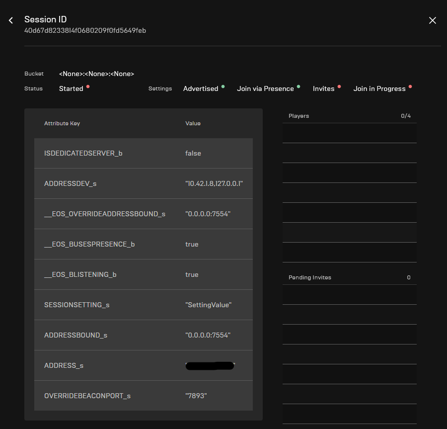

With everything set up, it's now time to run a game server container on your cluster manually so that we can make sure that network connections are working.

## Creating a game server with the pushed image

On the Kubernetes control node, open a text editor with `nano game-server.yaml`, and then define a game server in it. You can use the following file as a template, but make sure you update:

- `image`: This should be replaced with the URL you pushed to when [preparing your game server](/dedis/preparing_your_game_server.mdx#pushing-the-packaged-game-server-to-gitlab).
- `resources`: Adjust this for the resources your game server container will require.
- `initialDelaySeconds`: Adjust this for how long it takes your game server container to fully start up.

```yaml
apiVersion: "agones.dev/v1"
kind: GameServer
metadata:
  generateName: "eos-dedicated-server-"
spec:
  health:
    # Adjust this for how long it takes your game server container to start serving traffic.
    initialDelaySeconds: 120
    periodSeconds: 10
    failureThreshold: 10
  ports:
    - name: game
      portPolicy: Dynamic
      containerPort: 7777
    # Example on defining beacon ports. If your game doesn't use beacons
    # you can remove this port definition.
    - name: beacon
      portPolicy: Dynamic
      containerPort: 12345
  template:
    spec:
      # Don't forget to use your GitLab pull secret.
      imagePullSecrets:
        - name: gitlab
      containers:
        - name: eos-dedicated-server
          # Update the image to the URL you pushed your packaged game server to.
          image: registry.gitlab.com/redpointgames/internal/eos-game-server:latest
          resources:
            requests:
              # Adjust these values for your game server.
              # 1GB of RAM
              memory: "1Gi"
              # 1.5 vCPU
              cpu: "1500m"
            limits:
              # These should be the same settings as requests.
              memory: "1Gi"
              cpu: "1500m"
```

Then:

- Press `Ctrl-O` and hit Enter to save the file.
- Press `Ctrl-X` to quit the text editor.

Create the game server container by running the following command:

```bash
kubectl create -f game-server.yaml
```

You should then see output similar to the following:

```
gameserver.agones.dev/eos-dedicated-server-x9ddb created
```

You can check if the game server container is ready by running `kubectl get gameserver`:

```
root@west-europe-01:/home/jrhodes# kubectl get gameserver
NAME                         STATE       ADDRESS           PORT   NODE             AGE
eos-dedicated-server-x9ddb   Ready       126.118.159.102   7554   west-europe-03   91s
```

## Testing the session is visible in the EOS backend

You can get the logs for your game server container with a command like this:

```bash
kubectl logs eos-dedicated-server-x9ddb eos-dedicated-server
```

In the logs, you should see the ID of the session the server created on the EOS backend; something similar to:

```bash
[2022.04.05-05.53.31:615][162]LogRedpointEOS: Verbose: CreateSession: Successfully created session 'MyLocalSessionName' with ID '40d67d8233814f0680209f0fd5649feb'
```

In the [Epic Games Developer Portal](https://dev.epicgames.com/portal), search for the session ID that you see in the logs under "Game Services" -> "Matchmaking".



You should see the `PORT` value in the `__EOS_OVERRIDEADDRESSBOUND_s` attribute.

## Testing connectivity from the client

In the editor, launch a standalone game from the `Play` button in the toolbar.

Make sure you can see the session that the game server container created in the sessions list from the client, and then try to join it. If everything is set up correctly, you should be able to connect to the game server container from your game client.

:::info
If you can't seem to connect via the sessions list, or you haven't implemented that functionality in your game client yet, you can alternatively connect by pressing `~` and then typing:

```
open <address>:<port>
```

Where `<address>` and `<port>` should be replaced with the values shown in `kubectl get gameservers`.
:::

When your client connects to the game server container, you should be able to see the appropriate log entries with `kubectl logs -f`:

```
[2022.04.05-06.04.32:279][923]LogNet: Login request: ?Name=redpointqa0001 userId: RedpointEOS:000274d6c90e403ba35bb068391c0d38 platform: RedpointEOS
[2022.04.05-06.04.32:312][924]LogNet: Client netspeed is 100000
[2022.04.05-06.04.32:680][935]LogNet: Join request: /Game/ExampleOSS/Common/Multiplayer/MultiplayerMap?Name=redpointqa0001?SplitscreenCount=1
[2022.04.05-06.04.32:704][935]LogNet: Join succeeded: redpointqa0001
```

## Clean up after testing

Once you've finished your testing, delete the game server container with:

```bash
kubectl delete gameserver/eos-dedicated-server-x9ddb
```
