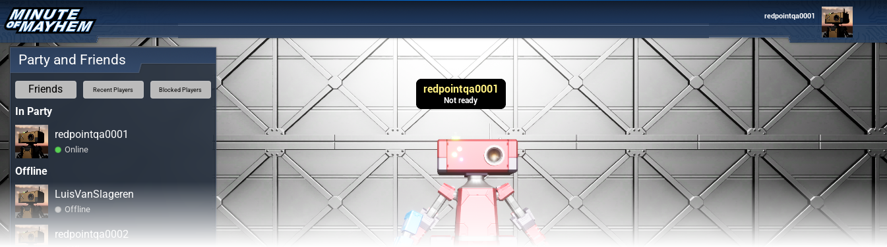
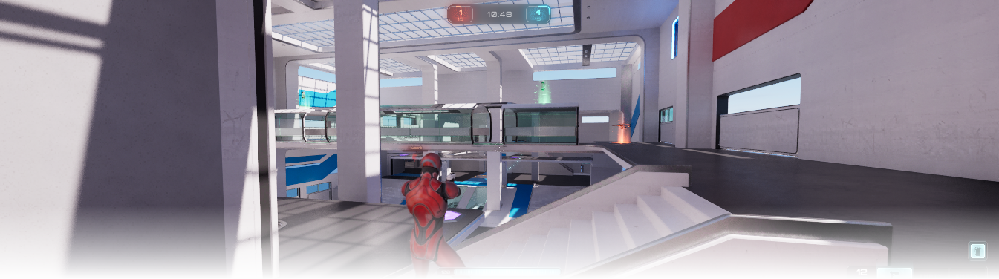

import Button from "@site/src/Button";

To get started with Epic Online Services, you can [add the EOS Online Framework to your existing project](../setup/index.mdx), or you can start with one of our example projects.

## Minute of Mayhem

Minute of Mayhem is our recommended example project. It demonstrates how to use the exclusive features of EOS Online Framework, and does not require you to use C++.

<Button href="./minute/" text="View documentation for Minute of Mayhem" />

## Lyra

We've modified Lyra to work with EOS Online Framework out-of-the-box. We don't recommend Lyra as a starting point for new developers, as it requires C++ knowledge to use.

<Button href="./lyra" text="View documentation for Lyra" />
