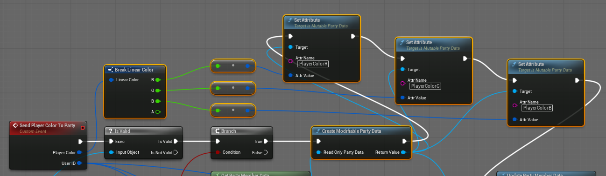

import Video from "@site/src/Video";
import Blueprint from "@site/src/Blueprint";

import changingRobotColorUrl from "./video/changing_robot_color.mp4";
import bpMainMenuPlayerPreview from "./blueprints/main_menu_player_preview.bp";
import bpPlayerPreferencesScreen from "./blueprints/player_preferences_screen.bp";
import bpMGIChangePlayerColor from "./blueprints/minute_game_instance_ChangePlayerColor.bp";
import bpMGISavePlayerPreferencesToCloudInBackground from "./blueprints/minute_game_instance_save-player-preferences-to-cloud-in-background.bp";
import bpMGISendPlayerColorToParty from "./blueprints/minute_game_instance_SendPlayerColorToParty.bp";
import bpMGIInitialise from "./blueprints/minute_game_instance_Initialise.bp";
import bpMGIOnLoginComplete from "./blueprints/minute_game_instance_OnLoginComplete.bp";
import bpMainMenuLobbySlot from "./blueprints/main_menu_lobby_slot.bp";

<Video url={changingRobotColorUrl} />

This documentation will explain how we save, load and change player color in Minute of Mayhem, starting with collecting player input through to how their choice is saved and loaded with User Cloud and finally how that color is sent to other players via the party system.

It is designed as a reference to use while you have the Minute of Mayhem example project open.

## Overview
The documentation below refers to the following assets and systems
#### Assets
- **Player Preferences:** `Content\Redpoint\Game\Player\PlayerPreferences.uasset`
- **Minute Game Instance:** `Content\Redpoint\MinuteGameInstance.uasset`
- **Player Preferences Screen:** `Content\Redpoint\MainMenu\Screens\PlayerPreferences\PlayerPreferencesScreen.uasset`
- **DefaultEngine.ini** `Redpoint\MinuteOfMayhem\Config\DefaultEngine.ini`
- **Main Menu Lobby Slot:** `Content\Redpoint\MainMenu\Screens\Lobby\MainMenuLobbySlot.uasset`
- **Main Menu Player Preview** `Content\Redpoint\MainMenu\MainMenuPlayerPreview.uasset`
- **Lobby Screen** `Content\Redpoint\MainMenu\Screens\Lobby\W_LobbyScreen.uasset`
#### Systems
- Saving and loading is done with [user cloud](./../../ossv1/user_cloud/reading.mdx)
- Colors are sent to other players as [party data](./../../ossv1/parties/data.mdx) using the party system
- Player preferences are stored in a `USaveGame` object from Unreal Engine's [Save Game](https://dev.epicgames.com/documentation/en-us/unreal-engine/saving-and-loading-your-game-in-unreal-engine) system
- The **player preferences**  object is stored in a variable on **minute game instance** which is a `UGameInstance` from Unreal Engine's [Game Instance](https://dev.epicgames.com/documentation/en-us/unreal-engine/API/Runtime/Engine/Engine/UGameInstance) system

## Storing player color at runtime
When a player chooses a color they expect the game to keep track of that color, in this example we created a blueprint called **player preferences** which inherits from `USaveGame` to store that data in a format that is easy to save and load.

In order for **player preferences** to persist between maps it will need to be stored somewhere that it won't be unloaded as part of changing maps and we can do that with **minute game instance** which inherits from `UGameInstance`.

## Loading player color at login

**User Cloud** allows for data to be saved by file name, which can be used for logically separating data for example save slots or storing different types of data in different file names. In this example we serialized **player preferences** and save it in a file called 'PlayerCharacterDataFileName'.

For more info see the [user cloud](./../../ossv1/user_cloud/reading.mdx) documentation and [Saving User Cloud data files](#saving-user-cloud-data-files) below for more details about how **player preferences** is serialized.

**Bonus note:** The text 'PlayerCharacterDataFileName' is stored inside of a variable to avoid any accidental typos which would unexpectedly save or load data from an incorrect save file name.

### Preloading User Cloud data files
Usually you will need to run `Enumerate User File` to load / open the latest version of the current user files and then call `Read User File` before finally reading the contents with `Get File Contents`.

However preloading **user cloud** data files allows us to skip the `Enumerate User File` and `Read User File` step as that will be done as part of preloading. 

Preloading can be configured by editing DefaultEngine.ini and adding `!PrecachePlayerDataStorageFiles` to the `[EpicOnlineServices]` section, repeat **line 140** below for as many file names as you would like to preload (eg change `PlayerCharacterDataFileName to the file name that you would like to preload)

**DefaultEngine.ini** `Redpoint\MinuteOfMayhem\Config\DefaultEngine.ini` 

### Initialize Minute Game Instance
Minute game instance has an initialize step triggered by `Event Init` which sets up the following
1. A new instance of **player preferences** needs to be created and stored in **Minute Game Instance's** player preferences variable
2. `On Login Complete` needs to be bound to the `online identity system's` OnLoginComplete event.
3. If the player is already logged in (When playing in-editor with Login before play-in-editor enable) then `On Login Complete` should be called as the player is already logged in when `On Login Complete` was bound so it won't be executed unless we call it now

**Minute Game Instance** `Event Init` <Blueprint height="400px" blueprint={bpMGIInitialise} />

### Reading Player Preferences from User Cloud data files

The initialization logic above should guarantee that `On Login Complete` is triggered exactly once after the player is logged and their cloud data files are ready to read (since we [preloaded their cloud data files in the previous step](#preloading-user-cloud-data-files))

This step gets the file contents of the 

**Minute Game Instance** `On Login Complete` <Blueprint height="400px" blueprint={bpMGIOnLoginComplete} />

### Saving User Cloud data files

Serialize **player preferences** with `Create File Data from Save Game` and then save it into a file called 'PlayerCharacterDataFileName' using the asynchronous task `WriteUserFile`.

**Minute Game Instance** `Save Player Preferences to Cloud in Background` <Blueprint height="400px" blueprint={bpMGISavePlayerPreferencesToCloudInBackground} />

## Selecting player color

The red, green and blue buttons are located in the **player preferences screen** and they each trigger the `Change Player Color` event in **minute game instance** with their respective colors.

**Player Preferences Screen** <Blueprint height="400px" blueprint={bpPlayerPreferencesScreen} />

## Handling Change Player Color events

Heading over to `Change Player Color` in **minute game instance** you can see that the `Robot Color` variable in **player preferences** is set the new player color and then `Save Player Preferences to Cloud in Background` is invoked to save the change to User Cloud followed by `Send Player Color To Party` to send the updated color to all party members.

**Minute Game Instance** `Change Player Color` <Blueprint height="400px" blueprint={bpMGIChangePlayerColor} />

## Sending player color to party
Player color needs to be sent to the party whenever a player joins a new party, and we do that with `Send Player Color To Party` event. Red green and blue color data is stored in **party member data** using the **party system**. See [managing party data](./../../ossv1/parties/data.mdx) documentation for more info.

### Overview

There are three logical steps to `Send Player Color To Party`.
1. Get a reference to the player's party member data
2. Update the player's party data with the new color
3. Send the updated party member data to the party

### Get party member data

Starting with a reference to the player controller from `Get Player Controller` which is then used to get a reference to the Local Player Subsystem, with that we can use `Get Primary Party` to get a reference to the player's primary party.

The party ID can then be used to get the player's member data using `Get Party Member Data` and then finally a modifiable version of party data can be created with `Create Modifiable Party Data`.

### Update party member data

Party member data is stored as key / value pairs with a `string` as the key, and `variant data` as the value. `Variant data` can only store **Boolean** (true/false), **Double** (a decimal number with double as many decimal places as a float), **Int64** (a very large whole number), or a **String** (text) values.

A `Linear Color` variable can not be directly sent via party member data, but we can send the red, green and blue values as separate `variant data` variables. First we convert the colors from floats to double and we save those to the player's party data with **PlayerColorR**, **PlayerColorG**, and **PlayerColorB** string keys.

### Send party member data

And the final step is to execute `Update Party Member Data` to send the updated party member data to the party. See the very last node in the full blueprint below.

### Full Blueprint

**Minute Game Instance** `Send Player Color To Party` <Blueprint height="600px" scale={(-4)} blueprint={bpMGISendPlayerColorToParty} />

## Receiving player color

This section covers reading player color from party member data and updating the player preview with that color.

### Lobby Slot & Player Preview structure

Lobby players are represented by **Main Menu Player Preview** which are child blueprint actors of **Main Menu Lobby Slot** and allow for player models to be set as visible or hidden as players leave and join the player's party.

Note: **Main Menu Lobby Slot** blueprint actors inherit from `ARedpointPartyMember` to receive events when the party member changes

### Party Member Changed event

A party member changed event is triggered whenever a member of the player's party joins, leaves or when their party member data changes. For instance this event is triggered each time any party member executes `Update Party Member Data` from the [Sending player color to party](#sending-player-color-to-party) step above.

### Set Player Preview to visible or hidden as required

This section of **Main Menu Player Preview** sets the player model to visible or hidden depending on if there is party member data for that party slot (eg if there is a person in that slot) see [managing party data](./../../ossv1/parties/data.mdx)

### Set Players to ready or not ready
Next we set if the player is ready or the party leader

### Deserialize player color
The red, green and blue party data is then turned back into a linear color ready to be used to be used on the player preview model  

### Set the model color
And the very last step is to set the color of the player preview model

**Main Menu Player Preview** `Set Color` <Blueprint height="340px" blueprint={bpMainMenuPlayerPreview} />

### Full Blueprint
**Main Menu Lobby Slot** `Event PartyMemberChanged` <Blueprint height="600px" blueprint={bpMainMenuLobbySlot} />

Thanks for following along!