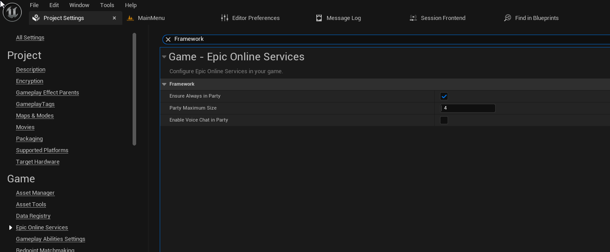

import Blueprint from "@site/src/Blueprint";

import bpGetPrimaryParty from "./automatic_parties/get_primary_party.bp";
import bpUpdatePartySize from "./automatic_parties/update_party_size.bp";

The Redpoint EOS Online Framework makes it easy to ensure that players are always in a party from the moment they login. If players ever leave their primary party later on, such as via the Epic Games overlay, the plugin will automatically create a new party for them. When this feature is turned on:

- You don't need to create a party on login; we ensure that the local player is in a party before login completes.
- The plugin will automatically leave the existing primary party when a player joins another party, including when they join via the overlay or a notification.
- If the player ever leaves the party, including in cases where they are kicked from the party by the party leader, we'll automatically create a new party for the local player.

## Enable automatic party management

In Project Settings, under "Epic Online Services":

1. Under the "Framework" category, turn on "Ensure Always in Party".
2. Set the "Party Maximum Size" to the desired default size.
   - You can change the size of the party at runtime, but this will be the default size used when a party has to be automatically created.
3. If you would like voice chat to be enabled in parties by default, turn on "Enable Voice Chat in Party".
   - You can always mute input and output of voice chat after the party has been created, but you can't enable voice chat on a party that didn't have it turned on when the party was created.

## Get the current party

You can get the party that the local player is currently in by using the "Get Primary Party" blueprint node on the local player subsystem.

:::warning
This can return a None object temporarily if the player was kicked from their previous party, and we haven't finished creating a new party for them yet.
:::

<Blueprint height="250px" blueprint={bpGetPrimaryParty} />

## Change the size of the party at runtime

You can change the size of the party, if you are the party leader, by using the "Update Party" blueprint node.

<Blueprint height="800px" blueprint={bpUpdatePartySize} />
