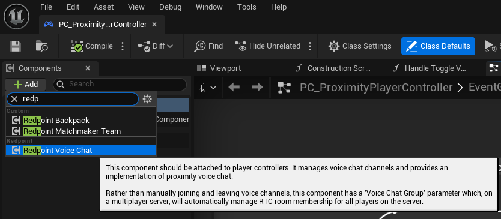
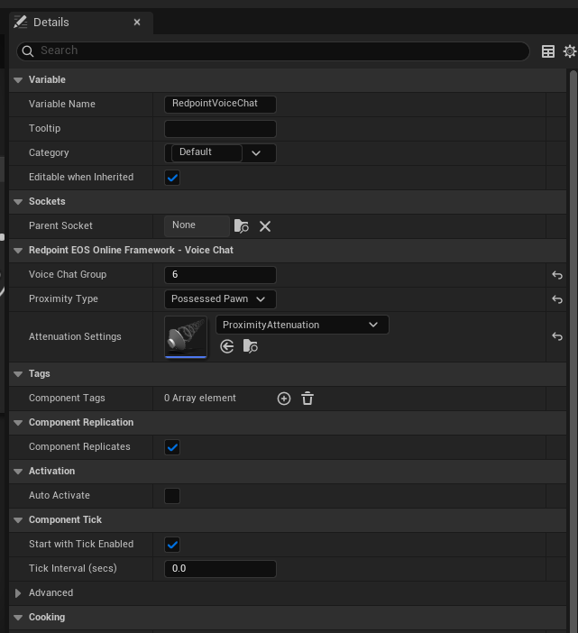

import Blueprint from "@site/src/Blueprint";
import NodeRef from "@site/src/components/NodeRef";

You can use the Redpoint Voice Chat component to automatically manage voice chat on multiplayer servers. It simplifies your voice chat implementation by managing voice chat channels for connected players, and can route each player's voice chat audio to the pawns they currently possess.

## Understanding voice chat groups

The voice chat component simplifies the implementation by allowing you to set the "voice chat group" on each player. Players with the same voice chat group will be able to hear each other. You don't need to know or manage voice chat channel names when using the voice chat component.

Some common implementations are:

- If you are building a cooperative game and you want all players on the server to hear each other, leave all players in voice chat group 0.
- If you are building a competitive game and you want team members to hear each other, set the voice chat group to the team ID.

You can change the voice chat group at any time on the game server, and players will connect to the necessary voice chat channel internally.

## Add the Redpoint Voice Chat component to your player controller

To use the component, you first need to add the component to your player controller blueprint:

## Configure the Redpoint Voice Chat component

After adding the component, there are only a few settings to configure:

- **Voice Chat Group**: Players with the same voice chat group set will be in the same voice chat channel.
- **Proximity Type**:
  - If set to 'None', no proximity or spatialisation will be applied to this player's voice chat audio when they are heard by other players.
  - If set to 'Possessed Pawn', the player's voice chat audio will appear to be coming from their possessed pawn or character on other game clients.
  - If set to 'Custom', the player's voice chat audio will appear to be coming from the actor you have set on the server via the "Set Custom Audio Anchor Point".
- **Attenuation Settings**: If proximity type is not set to None, you must set the attenuation settings which specifies how the voice chat audio is heard in the world.

## Blueprint nodes on the component

The following blueprint nodes can be called on both the client and server:

- <NodeRef name="Get Local User Id" /> Returns the local player's user ID.

The following blueprint nodes can be called only on the client:

- <NodeRef name="Is Input Muted" pure /> Returns whether this player's microphone
  is muted in this voice chat group.
- <NodeRef name="Set Input Muted" /> Sets whether this player's microphone is muted
  in this voice chat group.
- <NodeRef name="Get Input Volume" pure /> Returns the volume of this player's microphone
  in this voice chat group.
- <NodeRef name="Set Input Volume" /> Sets the volume of this player's microphone
  in this voice chat group, between 0.0 and 200.0 (2x volume).
- <NodeRef name="Is Output Muted" pure /> Returns whether this player's speaker is
  muted in this voice chat group.
- <NodeRef name="Set Output Muted" /> Sets whether this player's speaker is muted
  in this voice chat group.
- <NodeRef name="Get Output Volume" pure /> Returns the volume of this player's speaker
  in this voice chat group.
- <NodeRef name="Set Output Volume" /> Sets the volume of this player's speaker in
  this voice chat group, between 0.0 and 200.0 (2x volume).
- <NodeRef name="Get Other Member User Ids" pure /> Returns the list of other users
  that are currently in this player's voice chat group.
- <NodeRef name="Get All Member User Ids" pure /> Returns the list of all users (including
  this player) that are currently in this player's voice chat group.
- <NodeRef name="Is Member Output Local Muted" pure /> Returns if the other member
  in the voice chat group has been locally muted by this player.
- <NodeRef name="Set Member Output Local Muted" /> Sets the other member's audio
  to be locally muted or unmuted by this player.
- <NodeRef name="Get Member Output Local Volume" pure /> Returns the locally adjusted
  volume level of the other member in the voice chat group.
- <NodeRef name="Set Member Output Local Volume" /> Sets the other member's volume
  level to be locally adjusted by this player, between 0.0 and 200.0 (2x volume).
- <NodeRef name="Is Member Output Hard Muted" pure /> Returns if the other member
  in the voice chat group has been hard muted by the server.
- <NodeRef name="Is Member Blocked" pure /> Returns if the other member in the voice
  chat group has been blocked by the local player. If another member of the voice
  chat group is blocked by the local player, the local player's microphone audio
  will not be sent to them.
- <NodeRef name="Is Local User Speaking" pure /> Returns if the local player is currently
  speaking.
- <NodeRef name="Is Member Speaking" pure /> Returns if the member of the voice chat
  group is currently speaking.
- <NodeRef name="Get Member Audio Actor" pure /> Returns the actor that the other
  member's audio is being emitted from. This will be None if the target member is
  not emitting proximity-enabled audio, or if the actor has not been replicated by
  the server.

The following blueprint nodes can be called only on the server:

- <NodeRef name="Is Hard Muted on Server" pure /> Returns true if this player has
  been hard muted for all other players in the voice chat group.
- <NodeRef name="Set Hard Muted on Server" /> Sets whether this player should be
  hard muted for all other players in the voice chat group.
- <NodeRef name="Get Custom Audio Anchor Point" pure /> Returns the current custom
  audio anchor point.
- <NodeRef name="Set Custom Audio Anchor Point" /> Sets the custom audio anchor point.
  This only has an effect if the proximity type is set to 'Custom'.

## Blueprint nodes available anywhere

You can control the input and output audio devices on the client:

- <NodeRef name="Get Available Voice Chat Audio Devices" pure /> Returns the available
  audio devices that can be used with voice chat.
- <NodeRef name="Set Voice Chat Audio Input Device" /> Sets the input audio device
  that the user should use for voice chat.
- <NodeRef name="Set Voice Chat Audio Output Device" /> Sets the output audio device
  that the user should use for voice chat.
- <NodeRef name="Get Voice Chat Audio Input Device" pure /> Returns the current input
  audio device the user is using for voice chat.
- <NodeRef name="Get Voice Chat Audio Output Device" pure /> Returns the current
  output audio device the user is using for voice chat.
