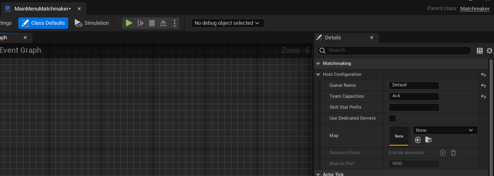

import Blueprint from "@site/src/Blueprint";

import bpHostConfiguration from "./bp/host_configuration.bp";

To set up your matchmaker, you'll need to create a blueprint that derives from the `Matchmaker` actor and configure it.

## Creating your custom matchmaker class

In the Content Browser of your project, click "Add/Import" ➞ "Blueprint Class".

When prompted for the Parent Class, select "All Classes" and then search for "Matchmaker":

## Setting up the host configuration

In order for matchmaking to work, you need to specify the host configuration. The host configuration tells the matchmaker what the team layout should be and how to complete matchmaking. This configuration only applies to the party leader and solo players - players in a party who are _not_ the party leader just follow what the leader does.

You can set up the default host configuration for your matchmaker in the "Class Defaults" of your blueprint:

There are a few options here for blueprint-based matchmaking.

### Queue Name

The queue name is the name of the matchmaking queue that players will be entered into. Players in matchmaking queues with different names can _never_ be matched together, regardless of settings.

All players entered into a given queue name should have the same team layout at a minimum, and ideally the host configuration should be as consistent as possible to avoid player confusion.

Typically you will have a different queue name for each game mode and team layout.

### Team Capacities

Team capacities, or the team layout, specifies how many players will be on each team. When parties are queued into matchmaking, they will not be split across teams. Therefore, your largest team size listed must be larger than the maximum size you allow for parties.

You can use values like these:

- `4v4`: 4 players vs 4 players
- `3v2v1`: 3 players vs 2 players vs one player
- `4x16`: 16 teams of 4 players each

:::caution
Epic Online Services has a maximum limit of 64 players in a lobby, and thus the maximum number of players you can have in your team layout is 64. For example, a team layout of `4x20` will not work, because you can not have 100 players in an Epic Online Services lobby.
:::

### Skill Stat Prefix

The prefix to use in the `<prefix>_mu` and `<prefix>_sigma` stats for skill-based matchmaking. Refer to the document on how to [turn on skill-based matchmaking](../skill_configuration.md) for more information.

### Use Dedicated Servers

If turned on, the matchmaker will search for dedicated servers to join instead of starting a listen server when matchmaking is complete.

### Map (Listen Servers Only)

This is the map that the hosting player will start for the multiplayer game. This only applies if you're not using dedicated servers. If you are using dedicated servers, the dedicated server determines the map that will be played on.

### Session Filters (Dedicated Servers Only)

This specifies the session filters that are applied when searching for dedicated servers in the sessions list. You can use this to find a dedicated server that is appropriate for the kind of match you're trying to play.

### Beacon Port (Dedicated Servers Only)

If you haven't change this on the beacon (see [Additional setup for dedicated servers](../dedicated_server_configuration.mdx)), you should leave it as the default. Otherwise, make sure it matches the setting on the beacon.

### Allow Partially Filled Matches

If true, finish matchmaking with a partially filled match if no further candidates could be found within the specified timeout.

### Minimum Team Member Count For Partial Fill

If partial matches are enabled, this is the minimum number of players that must be on each team in the match before a partial match will complete. For example, you could use this to make sure that every team has at least one player on it in a partial match. If the minimum member count is not met when the timeout is reached, the matchmaking process will continue instead of timing out.

### No Candidates Timeout

If partial matches are enabled, this is the timeout in seconds after which, if we still can't find any other candidates to match with, a partially filled match will be returned. Note that this is _not_ a global timeout for the entire matchmaking process. It is just the time since the last player was added to the match.

### No Candidates Timeout Per Empty Slot

The time in seconds to add to the timeout for each currently empty slot in the match. If this is non-zero, matchmaking will wait longer to return a partial match, the more empty the match currently is.

### Prioritize Balance

If true, matchmaking will prioritize having balanced teams throughout the matchmaking process, rather than prioritizing having completely full teams. Enabling this option means a partially filled match is more likely to have a balanced number of players, at the cost of having a higher chance that a match will be partially filled if there are not a lot of solo players entering the matchmaking queue.

## Adjusting host configuration dynamically

You can also change the host configuration at runtime through blueprints. Just call "Set Host Configuration" before all players are ready.

<Blueprint height="250px" blueprint={bpHostConfiguration} />
