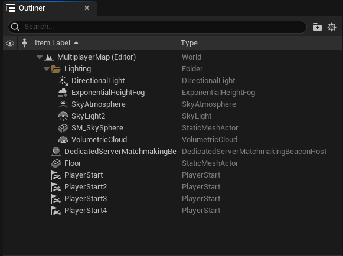

import Blueprint from "@site/src/Blueprint";

import bpLifecycle from "./dedicated_server_configuration/lifecycle.bp";

In addition to configuring the matchmaking settings to search for dedicated servers, you also need to add a beacon to your multiplayer map so that clients can reserve game servers correctly.

For configuring the matchmaker to search for dedicated servers, see the following pages instead:

- [Setting up the matchmaker (blueprints)](./blueprints/matchmaker.mdx)
- [Queue to matchmaking (C++)](./cpp/queue_to_matchmaking.md)

You need to configure the matchmaker as per the links above _and_ add the beacon as described in this page.

## Add the dedicated server beacon to your map

Locate the map that your dedicated server will start with in Project Settings. If you search for 'map', it's the "Server Default Map" option.

Open the server startup map, and using the Place Actors window (found under 'Window -> Place Actors'), add the 'Dedicated Server Matchmaking Beacon Host' actor to your map.

Afterwards, the beacon should appear in the Outliner like so:

## Configure the dedicated server beacon

You can configure the dedicated server beacon settings inline in the editor. You can also create a derived blueprint class from the beacon. If you have multiple maps that the dedicated server can start as, it's recommended to create a derived blueprint class so you can keep your configuration consistent across maps.

The available options are:

- **Beacon Port**: Generally there's no need to change this. If you change it from the default, you must also change the beacon port in the blueprint Matchmaker actor or in the configuration when queuing in C++.
- **Reservation Timeout Seconds**: The time in seconds that the dedicated server will wait for players to connect to the server after it has been reserved for a match. If the reservation times out, the server will kick any connected players and go back to being available for reservations.
- **Require All Players Connected for Match Start**: If ticked, all players must be connected to the server for the match to start upon reservation timeout, ensuring all players are present for the match. If this is not ticked, the match will start upon reservation timeout if at least the match leader is connected.
- **Allow Player Reconnections**: If ticked, players are allowed to reconnect to the game server while the match is ongoing. If not set, players will not be able to reconnect mid-match. You should set this depending on whether or not your game can tolerate players disconnecting and reconnecting in the middle of a match.

## Listen for reservation events

There are some important events on the dedicated server beacon that you will want to bind event handlers to:

- **On Match Ready to Start**: This event is raised when the game server is ready to start the match. There are some important steps that you need to take (see below) to manage the lifecycle of the dedicated server.
- **On Reservation Status Changed**: This event is raised when the dedicated server is reserved or unreserved (either due to a timeout or because the match has ended).

Both of these events are passed a "Reservation" struct, which indicates the original requested team layout (e.g. 2v2) when players queued, as well as the player assigned to each slot. If matchmaking produced only a partially filled match, "Has User" will be false for some slots in the reservation.

## Managing the server's lifecycle

:::caution
In a future release we intend to handle most of the lifecycle for you, as automatically managing the lifecycle is necessary for us to support backfilling in a future release.

If you're using dedicated servers with matchmaking, please pay attention to the changelog when upgrading as you will need to remove your manual session calls (such as "Create Session") in a future release.
:::

To ensure that game clients can discover the game server only at appropriate times, you need to make calls to the online session interface to manage the server's lifecycle correctly:

1. Upon "Begin Play" of the default server map, you need to call ["Create Session"](../ossv1/sessions/creating.mdx#create-the-session) to list the server in the sessions list. The session needs to have the following settings set:
   - Should Advertise: true
   - Allow Join in Progress: false
   - Is Dedicated: true
   - Num Public Connections: (total number of players in the largest match configuration)
2. When you get the "On Match Ready to Start" event, you need to call "Start Session" on the online session interface. This tells the session list that the server is now in-use and should not be returned in search results.

When the match finishes, what you need to do depends on whether or not the game server will be re-used for another match. For server orchestrators like Agones, dedicated servers are terminated and re-launched after every match. If you're hosting the game server without Agones, you might need to re-use the server.

If you're _not_ re-using the game server (e.g. running under Agones):

3. When the match ends, call ["Destroy Session"](../ossv1/sessions/destroying.mdx#destroying-a-session) on the session interface. Agones will then terminate the server process, so you don't need to do anything after this.

If you're re-using the game server:

3. When the match ends, call "End Session" on the session interface. This will make the server appear in session search results again.
4. Kick any players that are still connected.
5. Reset the game server's state back to how it should be at the start of a match.
6. Call the "Match Ended" function on the beacon. This will make the server available for reservation again.

A full implementation of the server's lifecycle in blueprints (using Online Subsystem Blueprints) might look like:

<Blueprint height="800px" blueprint={bpLifecycle} />
