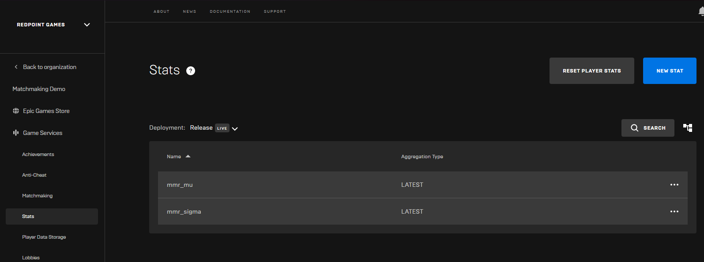
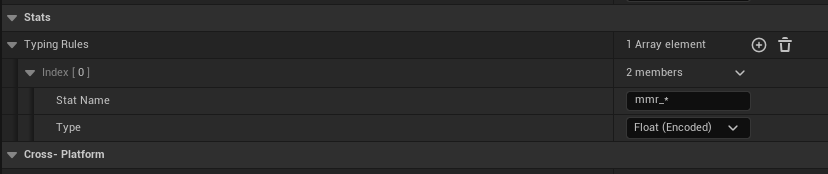

To turn on skill-based matchmaking, you need to configure stats that can be used to store each player's skill level on the Epic Online Services backend.

The plugin uses two stats to store a player's skill: `<prefix>_mu` and `<prefix>_sigma`. These are used by the [Openskill algorithm](https://github.com/OpenDebates/openskill.py) the plugin implements. You choose the prefix per matchmaking request, which allows you to have different skill rankings per player for different game modes.

## Create the stats for skill level

You first need to create the two stats in the [Epic Games Developer Portal](https://dev.epicgames.com/portal). For your product, create two stats in `LATEST` mode. Your stats configuration should look something like this (the example below is using `mmr` as the skill prefix):

Then in your game's Project Settings, you need to configure two things:

- Tell the EOS Online Framework plugin to encode the stats as "Float (Encoded)", based on the prefix you are using.
- Enable the "Accept Stat Write Requests from Servers".

Then, provide the stat prefix when queuing into matchmaking. For the examples above, the stat prefix to provide would be `mmr`.

## Next steps

You'll need to pass the "Skill Stat Prefix" when queuing players into matchmaking to enable skill-based matchmaking. You can learn how to do this with one of the topics here:

- [The Skill Stat Prefix setting in Blueprints](./blueprints/matchmaker.mdx#skill-stat-prefix)
- [Specifying the host configuration in C++](./cpp/queue_to_matchmaking.md#specifying-host-configuration)

Once you've played a game with skill-based matchmaking enabled, you'll need to submit the match results when the game ends. You can learn how to do this with one of the following topics:

- [Submitting match results from blueprints](./blueprints/submitting_match_results.mdx)
- [Submitting match results from C++](./cpp/submitting_match_results.md)
