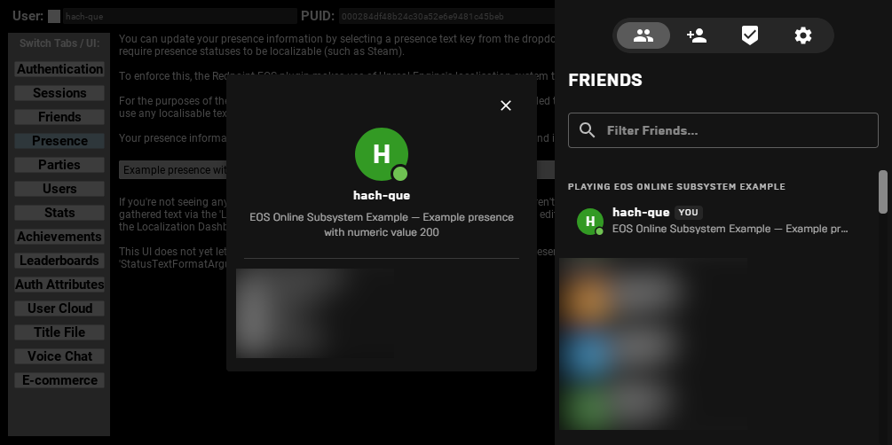
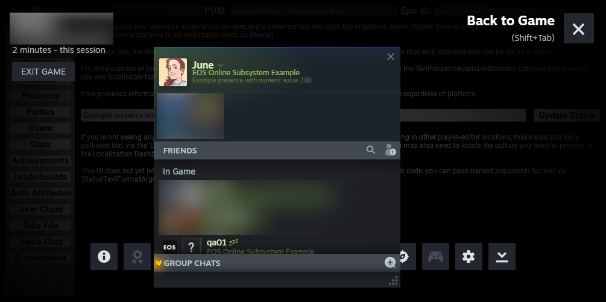

import useBaseUrl from '@docusaurus/useBaseUrl';
import Tabs from '@theme/Tabs';
import TabItem from '@theme/TabItem';
import Blueprint from '@site/src/Blueprint';

You can update the presence of the local user so that their friends and other players can see it. This allows you to advertise the current status of the player - whether they're in the main menu, in a party, currently in a match, and so on.

:::info
To ensure your game is compatible with platforms that require localised presence such as Steam, the `StatusStr` value provided to `IOnlinePresence::SetPresence` must be a localisable text key in the form `<Namespace>_<Key>`.
:::

## Setting up localisation

Before you can use presence, you need to set your Unreal Engine project up for localisation, as localisable presence is mandatory on platforms such as Steam.

1. Under Project Settings -> Packaging, ensure that "Internationalization Support" is set to "All".
2. Open the Localization Dashboard from Tools -> Localization Dashboard.
3. If you're building a game that has C++ source code, then for the Game target, enable "Gather from Text Files" and ensure Search Directories has `Source/*` as an entry.
4. For the Game target, enable "Gather from Packages" and ensure Include Path Wildcards has `Content/*` as an entry.
5. Under Cultures, add at least one culture (e.g. English) if it is not already present.
6. Click "Gather Text" and wait for it to complete.
7. Click "Compile Text" and wait for it to complete.
8. You should see the word count reflect the number of words you have in text values in blueprints and `NSLOCTEXT`/`LOCTEXT` macros in your source code.

## Update the player's status

<Tabs lazy groupId="code-format" defaultValue="c++" values={[ { label: 'C++', value: 'c++' }, { label: 'Blueprints', value: 'blueprints' } ]}>
<TabItem value="c++">

To update a player's status, use the `SetPresence` function on the presence interface, like so:

```cpp
IOnlineSubsystem *Subsystem = Online::GetSubsystem(this->GetWorld());
IOnlineIdentityPtr Identity = Subsystem->GetIdentityInterface();
IOnlinePresencePtr Presence = Subsystem->GetPresenceInterface();

FText MyPresence = NSLOCTEXT("MyGame", "PresenceStatus", "This is my custom status!");

FOnlineUserPresenceStatus Status;
Status.State = EOnlinePresenceState::Online;
Status.StatusStr = TEXT("MyGame_PresenceStatus");

Presence->SetPresence(
    *Identity->GetUniquePlayerId(0).Get(),
    Status,
    IOnlinePresence::FOnPresenceTaskCompleteDelegate::CreateLambda([](
        const class FUniqueNetId &UserId,
        const bool bWasSuccessful)
        {
            // Check bWasSuccessful.
        }));
```

</TabItem>
<TabItem value="blueprints">

In addition to the blueprint graph below, you'll need a string table or other text reference that can create a text value of "This is my custom status!" to a text namespace `MyGame` and text key `PresenceStatus`.

<Blueprint height="375px" blueprint={`Begin Object Class=/Script/BlueprintGraph.K2Node_GetSubsystem Name="K2Node_GetSubsystem_0"
   CustomClass=Class'"/Script/OnlineSubsystemBlueprints.OnlinePresenceSubsystem"'
   NodePosX=1536
   NodePosY=3920
   NodeGuid=90F4408F407F0235573E07A2EFCB8452
   CustomProperties Pin (PinId=F182360942A9C94F072B1BAF9A0CF5F9,PinName="ReturnValue",Direction="EGPD_Output",PinType.PinCategory="object",PinType.PinSubCategory="",PinType.PinSubCategoryObject=Class'"/Script/OnlineSubsystemBlueprints.OnlinePresenceSubsystem"',PinType.PinSubCategoryMemberReference=(),PinType.PinValueType=(),PinType.ContainerType=None,PinType.bIsReference=False,PinType.bIsConst=False,PinType.bIsWeakPointer=False,PinType.bIsUObjectWrapper=False,PinType.bSerializeAsSinglePrecisionFloat=False,LinkedTo=(K2Node_AsyncAction_0 F259080645588546A7984F8A79953521,),PersistentGuid=00000000000000000000000000000000,bHidden=False,bNotConnectable=False,bDefaultValueIsReadOnly=False,bDefaultValueIsIgnored=False,bAdvancedView=False,bOrphanedPin=False,)
End Object
Begin Object Class=/Script/BlueprintGraph.K2Node_AsyncAction Name="K2Node_AsyncAction_0"
   ProxyFactoryFunctionName="SetPresence"
   ProxyFactoryClass=Class'"/Script/OnlineSubsystemBlueprints.OnlinePresenceSubsystemSetPresence"'
   ProxyClass=Class'"/Script/OnlineSubsystemBlueprints.OnlinePresenceSubsystemSetPresence"'
   NodePosX=1856
   NodePosY=3901
   NodeGuid=864CDE0A4246E2F39B16128BE676211E
   CustomProperties Pin (PinId=66C79B8D43CE5A5F94B69088383430D9,PinName="execute",PinToolTip="\\nExec",PinType.PinCategory="exec",PinType.PinSubCategory="",PinType.PinSubCategoryObject=None,PinType.PinSubCategoryMemberReference=(),PinType.PinValueType=(),PinType.ContainerType=None,PinType.bIsReference=False,PinType.bIsConst=False,PinType.bIsWeakPointer=False,PinType.bIsUObjectWrapper=False,PinType.bSerializeAsSinglePrecisionFloat=False,PersistentGuid=00000000000000000000000000000000,bHidden=False,bNotConnectable=False,bDefaultValueIsReadOnly=False,bDefaultValueIsIgnored=False,bAdvancedView=False,bOrphanedPin=False,)
   CustomProperties Pin (PinId=81AF345F47E65B0F3007A7B3F661A070,PinName="then",Direction="EGPD_Output",PinType.PinCategory="exec",PinType.PinSubCategory="",PinType.PinSubCategoryObject=None,PinType.PinSubCategoryMemberReference=(),PinType.PinValueType=(),PinType.ContainerType=None,PinType.bIsReference=False,PinType.bIsConst=False,PinType.bIsWeakPointer=False,PinType.bIsUObjectWrapper=False,PinType.bSerializeAsSinglePrecisionFloat=False,PersistentGuid=00000000000000000000000000000000,bHidden=False,bNotConnectable=False,bDefaultValueIsReadOnly=False,bDefaultValueIsIgnored=False,bAdvancedView=False,bOrphanedPin=False,)
   CustomProperties Pin (PinId=F69D848941F388FC1B0C17A61214915D,PinName="OnCallFailed",PinFriendlyName="On Call Failed",PinToolTip="On Call Failed",Direction="EGPD_Output",PinType.PinCategory="exec",PinType.PinSubCategory="",PinType.PinSubCategoryObject=None,PinType.PinSubCategoryMemberReference=(),PinType.PinValueType=(),PinType.ContainerType=None,PinType.bIsReference=False,PinType.bIsConst=False,PinType.bIsWeakPointer=False,PinType.bIsUObjectWrapper=False,PinType.bSerializeAsSinglePrecisionFloat=False,PersistentGuid=00000000000000000000000000000000,bHidden=False,bNotConnectable=False,bDefaultValueIsReadOnly=False,bDefaultValueIsIgnored=False,bAdvancedView=False,bOrphanedPin=False,)
   CustomProperties Pin (PinId=6877B0F64996AA0455D8AFA9DD9B3BFE,PinName="OnPresenceTaskComplete",PinFriendlyName="On Presence Task Complete",PinToolTip="On Presence Task Complete",Direction="EGPD_Output",PinType.PinCategory="exec",PinType.PinSubCategory="",PinType.PinSubCategoryObject=None,PinType.PinSubCategoryMemberReference=(),PinType.PinValueType=(),PinType.ContainerType=None,PinType.bIsReference=False,PinType.bIsConst=False,PinType.bIsWeakPointer=False,PinType.bIsUObjectWrapper=False,PinType.bSerializeAsSinglePrecisionFloat=False,PersistentGuid=00000000000000000000000000000000,bHidden=False,bNotConnectable=False,bDefaultValueIsReadOnly=False,bDefaultValueIsIgnored=False,bAdvancedView=False,bOrphanedPin=False,)
   CustomProperties Pin (PinId=43076A96466CFCF942CE84B252523D72,PinName="UserId",PinToolTip="User Id\\nUnique Net Id Structure",Direction="EGPD_Output",PinType.PinCategory="struct",PinType.PinSubCategory="",PinType.PinSubCategoryObject=ScriptStruct'"/Script/Engine.UniqueNetIdRepl"',PinType.PinSubCategoryMemberReference=(),PinType.PinValueType=(),PinType.ContainerType=None,PinType.bIsReference=False,PinType.bIsConst=False,PinType.bIsWeakPointer=False,PinType.bIsUObjectWrapper=False,PinType.bSerializeAsSinglePrecisionFloat=False,PersistentGuid=00000000000000000000000000000000,bHidden=False,bNotConnectable=False,bDefaultValueIsReadOnly=False,bDefaultValueIsIgnored=False,bAdvancedView=False,bOrphanedPin=False,)
   CustomProperties Pin (PinId=DE70DC5540B2117EDB107683AFEBDE40,PinName="bWasSuccessful",PinToolTip="Was Successful\\nBoolean",Direction="EGPD_Output",PinType.PinCategory="bool",PinType.PinSubCategory="",PinType.PinSubCategoryObject=None,PinType.PinSubCategoryMemberReference=(),PinType.PinValueType=(),PinType.ContainerType=None,PinType.bIsReference=False,PinType.bIsConst=False,PinType.bIsWeakPointer=False,PinType.bIsUObjectWrapper=False,PinType.bSerializeAsSinglePrecisionFloat=False,PersistentGuid=00000000000000000000000000000000,bHidden=False,bNotConnectable=False,bDefaultValueIsReadOnly=False,bDefaultValueIsIgnored=False,bAdvancedView=False,bOrphanedPin=False,)
   CustomProperties Pin (PinId=F259080645588546A7984F8A79953521,PinName="Subsystem",PinToolTip="Subsystem\\nOnline Presence Subsystem Object Reference",PinType.PinCategory="object",PinType.PinSubCategory="",PinType.PinSubCategoryObject=Class'"/Script/OnlineSubsystemBlueprints.OnlinePresenceSubsystem"',PinType.PinSubCategoryMemberReference=(),PinType.PinValueType=(),PinType.ContainerType=None,PinType.bIsReference=False,PinType.bIsConst=False,PinType.bIsWeakPointer=False,PinType.bIsUObjectWrapper=False,PinType.bSerializeAsSinglePrecisionFloat=False,LinkedTo=(K2Node_GetSubsystem_0 F182360942A9C94F072B1BAF9A0CF5F9,),PersistentGuid=00000000000000000000000000000000,bHidden=False,bNotConnectable=False,bDefaultValueIsReadOnly=False,bDefaultValueIsIgnored=False,bAdvancedView=False,bOrphanedPin=False,)
   CustomProperties Pin (PinId=36E2FE22450EFB1682818889112F4EB4,PinName="User",PinToolTip="User\\nUnique Net Id Structure",PinType.PinCategory="struct",PinType.PinSubCategory="",PinType.PinSubCategoryObject=ScriptStruct'"/Script/Engine.UniqueNetIdRepl"',PinType.PinSubCategoryMemberReference=(),PinType.PinValueType=(),PinType.ContainerType=None,PinType.bIsReference=False,PinType.bIsConst=False,PinType.bIsWeakPointer=False,PinType.bIsUObjectWrapper=False,PinType.bSerializeAsSinglePrecisionFloat=False,PersistentGuid=00000000000000000000000000000000,bHidden=False,bNotConnectable=False,bDefaultValueIsReadOnly=False,bDefaultValueIsIgnored=False,bAdvancedView=False,bOrphanedPin=False,)
   CustomProperties Pin (PinId=4BFFB1C341DECC6E6B8C9E8BF8611769,PinName="Status",PinToolTip="Status\\nOnline User Presence Status Data Structure",PinType.PinCategory="struct",PinType.PinSubCategory="",PinType.PinSubCategoryObject=ScriptStruct'"/Script/OnlineSubsystemBlueprints.OnlineUserPresenceStatusData"',PinType.PinSubCategoryMemberReference=(),PinType.PinValueType=(),PinType.ContainerType=None,PinType.bIsReference=False,PinType.bIsConst=False,PinType.bIsWeakPointer=False,PinType.bIsUObjectWrapper=False,PinType.bSerializeAsSinglePrecisionFloat=False,LinkedTo=(K2Node_MakeStruct_0 4E38A7D842C07CB7902F6A874468C8EA,),PersistentGuid=00000000000000000000000000000000,bHidden=False,bNotConnectable=False,bDefaultValueIsReadOnly=False,bDefaultValueIsIgnored=False,bAdvancedView=False,bOrphanedPin=False,)
End Object
Begin Object Class=/Script/BlueprintGraph.K2Node_MakeStruct Name="K2Node_MakeStruct_0"
   bMadeAfterOverridePinRemoval=True
   ShowPinForProperties(0)=(PropertyName="Status",PropertyFriendlyName="Status",PropertyTooltip="Status",CategoryName="Online",bShowPin=True,bCanToggleVisibility=True)
   ShowPinForProperties(1)=(PropertyName="State",PropertyFriendlyName="State",PropertyTooltip="State",CategoryName="Online",bShowPin=True,bCanToggleVisibility=True)
   ShowPinForProperties(2)=(PropertyName="Properties",PropertyFriendlyName="Properties",PropertyTooltip="Properties",CategoryName="Online",bShowPin=True,bCanToggleVisibility=True)
   StructType=ScriptStruct'"/Script/OnlineSubsystemBlueprints.OnlineUserPresenceStatusData"'
   NodePosX=1360
   NodePosY=4032
   NodeGuid=53009CC445650C0A4473F999009A55C1
   CustomProperties Pin (PinId=4E38A7D842C07CB7902F6A874468C8EA,PinName="OnlineUserPresenceStatusData",Direction="EGPD_Output",PinType.PinCategory="struct",PinType.PinSubCategory="",PinType.PinSubCategoryObject=ScriptStruct'"/Script/OnlineSubsystemBlueprints.OnlineUserPresenceStatusData"',PinType.PinSubCategoryMemberReference=(),PinType.PinValueType=(),PinType.ContainerType=None,PinType.bIsReference=False,PinType.bIsConst=False,PinType.bIsWeakPointer=False,PinType.bIsUObjectWrapper=False,PinType.bSerializeAsSinglePrecisionFloat=False,LinkedTo=(K2Node_AsyncAction_0 4BFFB1C341DECC6E6B8C9E8BF8611769,),PersistentGuid=00000000000000000000000000000000,bHidden=False,bNotConnectable=False,bDefaultValueIsReadOnly=False,bDefaultValueIsIgnored=False,bAdvancedView=False,bOrphanedPin=False,)
   CustomProperties Pin (PinId=9014F2CB4D95FECB971A67962A4CB529,PinName="Status",PinFriendlyName="Status",PinToolTip="Status\\nString\\n\\nStatus",PinType.PinCategory="string",PinType.PinSubCategory="",PinType.PinSubCategoryObject=None,PinType.PinSubCategoryMemberReference=(),PinType.PinValueType=(),PinType.ContainerType=None,PinType.bIsReference=False,PinType.bIsConst=False,PinType.bIsWeakPointer=False,PinType.bIsUObjectWrapper=False,PinType.bSerializeAsSinglePrecisionFloat=False,DefaultValue="MyGame_PresenceStatus",PersistentGuid=00000000000000000000000000000000,bHidden=False,bNotConnectable=False,bDefaultValueIsReadOnly=False,bDefaultValueIsIgnored=False,bAdvancedView=False,bOrphanedPin=False,)
   CustomProperties Pin (PinId=E91371FC4E0F11B23D723CBBC51B6290,PinName="State",PinFriendlyName="State",PinToolTip="State\\nFOnlineUserPresenceStatusState Enum\\n\\nState",PinType.PinCategory="byte",PinType.PinSubCategory="",PinType.PinSubCategoryObject=Enum'"/Script/OnlineSubsystemBlueprints.FOnlineUserPresenceStatusState"',PinType.PinSubCategoryMemberReference=(),PinType.PinValueType=(),PinType.ContainerType=None,PinType.bIsReference=False,PinType.bIsConst=False,PinType.bIsWeakPointer=False,PinType.bIsUObjectWrapper=False,PinType.bSerializeAsSinglePrecisionFloat=False,DefaultValue="Online",AutogeneratedDefaultValue="Online",PersistentGuid=00000000000000000000000000000000,bHidden=False,bNotConnectable=False,bDefaultValueIsReadOnly=False,bDefaultValueIsIgnored=False,bAdvancedView=False,bOrphanedPin=False,)
   CustomProperties Pin (PinId=50EE16254E0247AADEB3419A600C03EB,PinName="Properties",PinFriendlyName="Properties",PinToolTip="Properties\\nMap of Strings to Strings\\n\\nProperties",PinType.PinCategory="string",PinType.PinSubCategory="",PinType.PinSubCategoryObject=None,PinType.PinSubCategoryMemberReference=(),PinType.PinValueType=(TerminalCategory="string"),PinType.ContainerType=Map,PinType.bIsReference=False,PinType.bIsConst=False,PinType.bIsWeakPointer=False,PinType.bIsUObjectWrapper=False,PinType.bSerializeAsSinglePrecisionFloat=False,PersistentGuid=00000000000000000000000000000000,bHidden=False,bNotConnectable=False,bDefaultValueIsReadOnly=False,bDefaultValueIsIgnored=True,bAdvancedView=False,bOrphanedPin=False,)
End Object
`} />
</TabItem>
</Tabs>

## Exporting localisation for Steam

If you're deploying your game on Steam, you'll need to upload localised presence values to the Steam partner portal.

:::info
We plan on automating this process in the future.
:::

1. Underneath `Content/Localization/Game/`, each folder (such as `en`) will have a file called `Game.archive` which contains all the text keys and translations.
2. Refer to the bottom of the [Steamworks Rich Presence](https://partner.steamgames.com/doc/features/enhancedrichpresence) documentation and create the localisation file. Each files underneath `Tokens` should have a key in the format `#<TextKey>_<TextNamespace>` and the value is the translated text value.
3. Upload the Rich Presence file to your applications Steamworks configuration under Community -> Rich Presence.

## Setting status properties for localised presence

To set dynamic values inside localised presence statuses, you need to add those dynamic values to `Properties`. Based on the parameter type, you'll need to set and embed them differently in Steam Rich Presence files:

<table style={{fontSize: '90%'}}>
    <thead>
        <tr>
            <th></th>
            <th>Int, UInt, Float, Double</th>
            <th>Text</th>
        </tr>
    </thead>
    <tr>
        <th>Setting the Property</th>
<td>

```cpp
Status.Properties.Add(
    TEXT("Prop"), 
    5.0f)
```

</td>
<td>

```cpp
NSLOCTEXT(
    "Game", 
    "TextValue", 
    "My text")
// ...
Status.Properties.Add(
    TEXT("Prop"), 
    TEXT("Game_TextValue"))
```

</td>
    </tr>
    <tr>
<th>

Referring to it inside `NSLOCTEXT`/`FText` values

</th>
<td>

```cpp
NSLOCTEXT(
    "Game", 
    "PresenceStatus",
    "My presence status with {Prop}")
```

</td>
<td>

```cpp
NSLOCTEXT(
    "Game", 
    "PresenceStatus", 
    "My presence status with {Prop}")
```

</td>
    </tr>
    <tr>
        <th>Referring to it inside Steam Rich Presence</th>
<td>

```json
"My presence status with %Prop%"
```

</td>
<td>

```json
"My presence status with "
```

</td>
    </tr>
    <tr>
        <th>How it will render</th>
        <td>My presence status with 5</td>
        <td>My presence status with My text</td>
    </tr>
</table>

## View player presence information

The presence status that you set will be visible on the local platform such as Steam, and in the Epic Games Social Overlay. For example:





To query presence in game, refer to [Querying presence information of other users](querying.mdx).