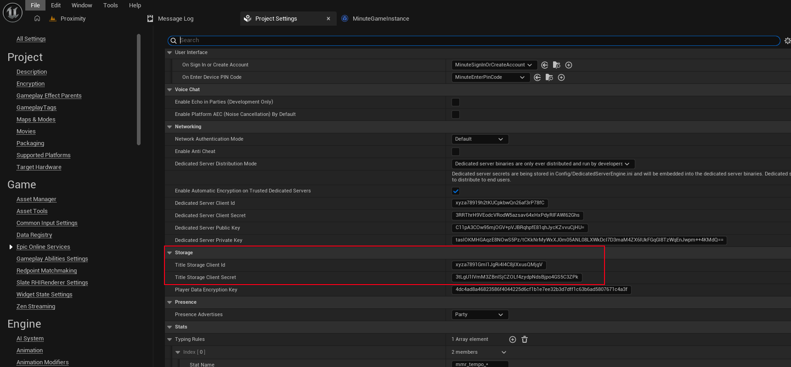

If you want to allow game clients to download from Title File storage before any user signs in, you'll need to create a separate client ID and secret for your product in the Epic Games Developer Portal, and set this client ID and secret into your Project Settings.

Under the **Product Settings** for your product in the portal, go to the **Clients** tab and scroll down to **Client policies**. Then click **Add new client policy**, and fill it out as follows:

- **Client policy name:** Give it a name like "Anonymous Title Storage Access".
- **Client policy type:** Select "Custom".
- **User required:** Leave unchecked.
- Turn off all features _except_ Title Storage, which should be turned on.
- Make sure all actions for Title Storage are turned on as well.
- Click **Add new client policy**.

Then, scroll up to **Clients**. Click on **Add new client**, and fill it out as follows:

- **Client name:** Give it a name like "(Your game) Anonymous Access".
- **Client policy:** Select the policy you just created.
- Click **Add new client**.
- Click the **...** next to the client you just created, then click **Edit**.
- Copy the client ID and client secret.

In your Project Settings, paste this client ID and secret into the "Title Storage Client Id" and "Title Storage Client Secret" fields:

