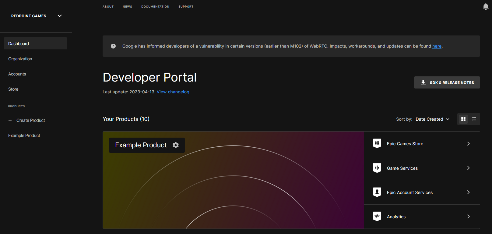

Before you can download files from Title Storage in your game, you need to upload them via the Epic Games Developer Portal.

After you've setup your EOS product in [The Developer Portal](/setup/index.mdx), login to the Developer Portal and select the organization you've created. You should now see a screen like this:

Press the "Games Services" button, then scroll down until you see the "Title Storage" service:

After you're on the Title Storage page, select the Deployment you want to upload a file for, then press "Add File":

Use the "Player Data Encryption Key" found in your project's Project Settings:

After you've entered your encryption key, choose a file you wish to upload and name it, then press save & close.

:::caution
You must add the tag "Default" when uploading the file, or the plugin will not list it when files are queried for the Title Storage service.
:::

When you're finished, you should see your file here:

