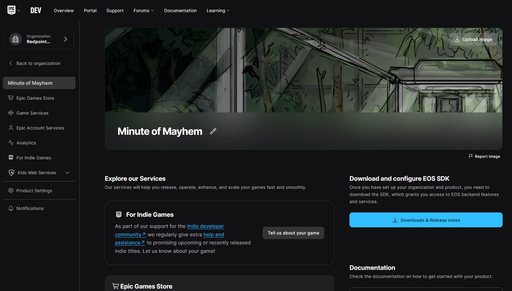
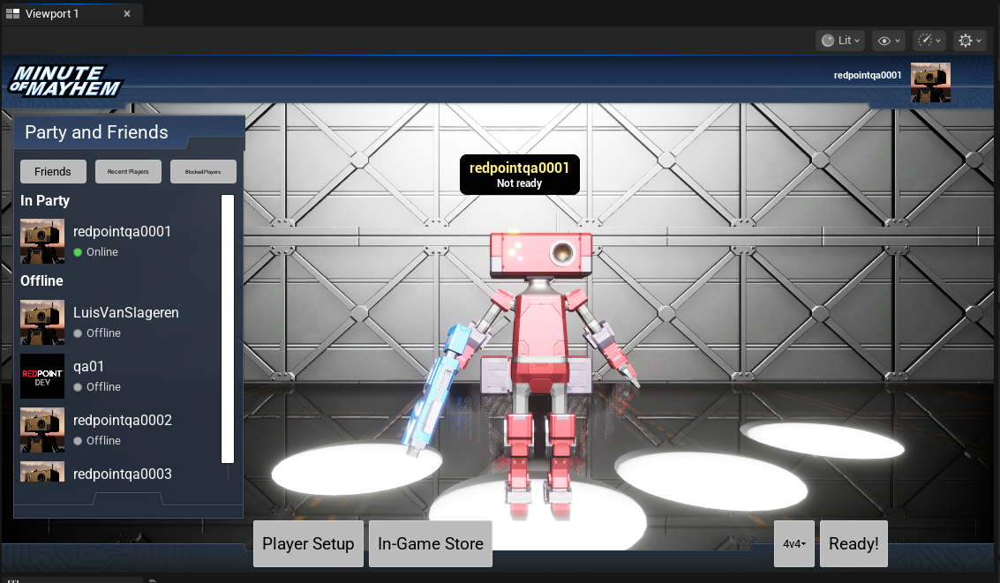

import { DownloadPlugin } from "@site/src/Welcome.tsx";
import { InstallSdk } from "@site/src/components/InstallSdk";

This guide will walk you through the process of installing the EOS Online Framework plugin, and configuring your project for Epic Online Services.

## Install the plugin

EOS Online Framework is provided in two editions: the Paid Edition and the Free Edition. Which version you use depends on whether you need support, source code access and whether you or the company you work for earns above the threshold.

If you want to use precompiled versions of the plugin, or you want to use the plugin in a blueprint-only project, you can install the plugin using the links below.

<DownloadPlugin />

## Create a product in the Epic Games Developer Portal

Before you can download the EOS SDK or use EOS Online Framework in your game, you'll need to create a product in the Epic Games Developer Portal. This will also provide you with the various IDs and secrets you need to later enter into Project Settings.

1. Sign into the [Epic Games Developer Portal](https://dev.epicgames.com/portal). If prompted, select the organisation that your game should be created under.
1. On the sidebar, click **Create Product**.
1. Give your product a name. You can change this later, so don't feel like you need to pick a final name right now.
1. When prompted, skip adding a cover image for your product. You can add one later.
1. You'll now see your new product in the sidebar and on the main screen.

## Installing the EOS SDK

<InstallSdk />

## Using the example projects

This guide can be used to set up your own new or existing Unreal Engine project, or to set up the [example project](../examples/minute/index.mdx) with your own EOS product ID.

## Create the client ID and secret for your product

To authenticate your game with the EOS backend, you need to create a client ID and secret for your product.

Click on your product in the sidebar. You should now see a screen like this:

1. Click **Product Settings** in the sidebar.
1. Under the **Clients** tab, click **Add New Client**.
1. When prompted, enter a name for the new client. If you're creating a multiplayer game with dedicated servers, this client is the client for players so name it appropriately; you'll create a separate client ID/secret for your dedicated servers later on in this guide.
1. Click **Add New Client Policy**.
1. Give the client policy an appropriate name. If you're creating a single player game, or a game where players host listen servers, select `Peer2Peer` as the client policy type. If you're creating a multiplayer game with dedicated servers, select `GameClient` as the client policy type.

:::note
Some plugin features require you to enable client policies that aren't enabled by default. If you run into permission denied errors in the Output Log when trying to use certain features, change the client policy type to Custom and turn on the features you need.
:::

6. Click **Save & Exit** for the client policy.
1. Click **Save & Exit** for the client.
1. You should now see your new client created, like so:

### Create a client for dedicated servers (optional)

If you're planning on using dedicated servers, make sure you create a separate client ID and secret for your dedicated servers, as outlined in [Creating a client ID and secret for your game server binaries](/dedis/preparing_your_game_server.mdx#creating-a-client-id-and-secret-for-your-game-server-binaries).

## Create an Epic Account Services application and link it to your client

In order for the Developer Authentication Tool to work, you need to set up Epic Account Services, even if you don't plan on using Epic Games accounts for end users. Using the Developer Authentication Tool is the recommended way of testing authentication and EOS features during development, so while optional, it's highly recommended that you follow these steps.

1. With your product open, in the sidebar click **Epic Account Services**.
1. You should see a screen like this, displaying the default application for your game:

3. Click on **Brand Settings - Not Configured** to configure it.
1. Set the application website and privacy policy links for your application, and upload an application logo. These don't need to be final because you'll leave this application in Draft status during development. You only need to set suitable values for end users if you plan on using Epic Games accounts in your game and you're closer to release.
1. Click **Save Draft**.
1. At the top-right of the page, click on **Permissions - Not Configured** to configure them.
1. Turn on **Online Presence**, **Friends** and **Country** permissions. The plugin requires these permissions, regardless of whether you intend to use them.
1. Click **Save Changes**.
1. At the top-right of the page, click on **Linked Clients - Not Configured** to configure them.
1. In the drop down, select the client you created earlier.

:::caution
If you don't link your client correctly, you won't be able to use the Developer Authentication Tool and you'll see a warning in the Output Log with `The Client is not configured correctly. Please make sure it is associated with an Application.` when you try to sign in or authenticate. **This is an extremely common problem that people run into**, so make sure you double check that your linked clients are set up correctly if you're having trouble authenticating with the Developer Authentication Tool.
:::

11. Click **Save Changes**.
1. Click **Back to Epic Account Services**. It's fine that "Brand Settings" still says "Not Configured", as you didn't submit it for review.
1. **IMPORTANT:** Make sure that "Linked Clients" says "Configured"!

## Copy the IDs and secrets into Project Settings

With everything set up in the EOS Developer Portal, you now need to copy the settings to Unreal Engine.

1. Open Unreal Engine, and in the toolbar click on **EOS - Epic Online Services**.
1. Click **Settings...**. You should see a screen like this:

3. Set "Product Name" and "Product Version" to any value you like. Recommended values are the name of your game and "1.0.0".
1. Back in the Developer Portal, with your product open, in the sidebar click **Product Settings**.
1. Scroll down until you can see "SDK Credentials".
1. Copy the following IDs and secrets into Project Settings:
   - Product ID
   - Client ID
   - Client Secret (use the copy button to copy the value)
   - Sandbox ID
   - Deployment ID

## Restart the editor

The EOS plugin does not load its online features if no client ID and secret is set. Since you've only just set the client ID and secret, the online features aren't currently available in the running instance of the Unreal Engine editor.

Restart the editor so that the plugin uses the settings you just set.

:::caution
You must restart the editor at this point, or the next steps in the guide won't work.
:::

## Testing authentication with the Developer Authentication Tool

It is now time to make sure that the plugin is working correctly and you're able to authenticate with the Developer Authentication Tool.

1. Open Unreal Engine, and in the toolbar click on **EOS - Epic Online Services**.
1. Click **Start Developer Authentication Tool**.
1. It will extract the tool the first time you click this button. This is normal.
1. When the tool starts, set the port to `6300` and click **Submit**.
1. Click **Login**.
1. Sign into the same Epic Games account you use to access the Epic Games Developer Portal.
1. When prompted, set the credential name to `Context_1`.

:::danger
This is **case sensitive** and it must exactly match `Context_1` for the first player in Unreal Engine. If you change your play settings in Unreal for multiple players, you'll need a different credential for each one (e.g. `Context_2` for the second player). This allows you easily test multiplayer scenarios with EOS, but you have to make sure the credential names match the `Context_...` pattern for Unreal Engine to be able to use them.
:::

:::caution
Since your Epic Account Services application is in Draft status, only Epic Games accounts that have permission to access your organisation in the Developer Portal can sign into the Developer Authentication Tool.

If you want to test with multiple accounts, you'll need to create multiple Epic Games accounts and add them to your organisation in the Developer Portal first.
:::

8. Go back to Unreal Engine, and in the toolbar click on **EOS - Epic Online Services**.
1. Turn on the **Login before play-in-editor** option.
1. Click the play icon in the toolbar to start playing in the editor. Make sure Unreal is configured to launch in "Selected viewport" if you're previously changed this setting.

If you're using the ["Minute of Mayhem" example project](../examples/minute/index.mdx), you'll see the game launch into an "already logged in" state. You should also see your account username in the top-right:

If you're not using an example project, you should see a successful sign in the Output Log if you filter for "Authentication":

:::info
Make sure you can see the "Authentication success" log entry! If you don't see this, then authentication isn't working. Double check all of the settings in the steps above, especially "Linked clients" for your Epic Account Services application, and try again.

If you still can't get authentication working at this point, please [reach out to support](/support/index.mdx).
:::

## Authenticating with Epic Games in packaged games

By default the plugin is configured to sign in with the account of the platform or store that a player is playing on. For example on Windows, the game will try to sign in with Steam, Discord, etc. by default. If it can't sign in with one of these accounts, then authentication will not work in a standalone or packaged build.

In most cases this is the correct behaviour - you don't want players to be able to play your game unless they have a valid purchase on a store like Steam. But if you're sending around early packaged builds of your game for community testing or QA, before you've published the game on a store or platform, you'll want to change your authentication settings.

If this is the case for you, then in Project Settings, locate the Epic Online Services configuration and change the authentication graph from "Default" to "Default, with Cross-Platform Fallback". This will allow the game to authenticate interactively with an Epic Games account if there's no other way to authenticate.

The [Configuring authentication](auth/configuration.mdx) page has full details on all of the authentication options that are available in the plugin.

## Next steps

You've now successfully set up your Unreal Engine project with Epic Online Services. Suggested next steps are:

- [Signing players in when the game is launched](framework/automatic_login.mdx)
- [Customize how players are authenticated, including requiring cross-platform accounts](auth/configuration.mdx)
- Configuring your project for the platform or store you want to publish on:
  - [Steam](platforms/steam.mdx)
  - [Epic Games Store](platforms/epic.mdx)
  - [itch.io](platforms/itchio.mdx)
  - [Discord](platforms/discord.mdx)
  - [GOG Galaxy](platforms/gog.mdx)
  - [Meta Quest](platforms/meta.mdx)
  - [Google on Android](platforms/google.mdx)
  - [Apple on iOS](platforms/apple.mdx)
  - [Console Platforms](platforms/consoles.mdx)
