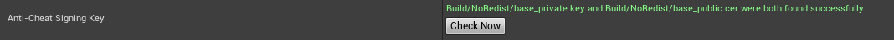

EOS Online Framework fully integrates EOS Anti-Cheat into Unreal Engine. You just need to download the Anti-Cheat certificates from the portal, and turn Anti-Cheat on in Project Settings.

You must have [network authentication](./authentication.mdx) turned in your Project Settings. It is turned on by default in new projects.

## Download your Anti-Cheat certificates

In the [Epic Online Services Portal](https://dev.epicgames.com/portal/en-US/), perform the following steps:

- If you haven't already signed the Anti-Cheat agreements, you need to do the following steps first:
  - Ensure you are logged into the account that has Owner permissions on the organisation. If you're not signed into the right account, you won't get the prompt.
  - Locate the product you want to enable Anti-Cheat on and go to "Game Services".
  - Under "Player Moderation", click on "Anti-Cheat".
  - You should get a prompt to review to the Anti-Cheat agreements. Accept them.
- Once you have the agreements accepted, go to the "Anti-Cheat" page for the product you want to enable Anti-Cheat on.
- Scroll down to the "All builds" section and next to the latest build, click the "..." and then "Activate Build".
  - These "builds" are the build of EAC that will run for your game. Epic allows you to choose when you upgrade and downgrade builds so that if a new version of EAC prevents your game from working properly, you can rollback to a previous version. When you're setting up a new game, you should always select the latest build for clicking "Activate Build".
- Once a build has been activated, scroll back up to the top and click "Download integrity keys", which should be highlighted in blue.
- Extract the ZIP file it gives you.
- Copy the `base_private.key` and `base_public.cer` files and place them under the `Build\NoRedist\` folder in your project. You might have to create this directory if it doesn't already exist.

When you open the EOS Project Settings in your project, you should now see the following:



If you don't, click "Check Now". If the keys still aren't found, make sure you placed them in the correct location.

## Enable Anti-Cheat

Under the Project Settings, ensure the "Enable Anti Cheat" option is turned on.

## Set trusted platforms

If you're building for console platforms, you can set them as trusted. Trusted platforms are permitted to connect to Anti-Cheat protected servers without running Anti-Cheat protection.

The plugin automatically generates the signing keys used by trusted client platforms, and it automatically manages the private key value in the `Platforms/<Platform>/Config/<Platform>Engine.ini` files as needed.

:::warning
By default the plugin will prevent you from selecting desktop or mobile platforms as trusted platforms, as they are not able to suitably protect the private keys. If someone can extract the private key from any platform, they can use this to impersonate and cheat from any device to an EAC protected server. Therefore, you should only enable console platforms as trusted platforms.

If you want to bypass these protections and defeat your own Anti-Cheat solution, you can add the following to the INI file of any non-console platform:

```
[EpicOnlineServices]
TrustedClientPublicKey=...
TrustedClientPrivateKey=...
```

:::

## Package your project

When you package the first Anti-Cheat enabled project for this engine, the plugin will patch engine build scripts so that your project can be signed successfully. However, these patches only apply as of the next build you do.

Therefore the first Anti-Cheat enabled build you do per engine _will not_ be signed. You need to package the game again if this is the case.

## Launching your Anti-Cheat protected game

When configuring your game launch in Steam and other platforms, you need to launch the `start_protected_game.exe` instead of `MyGame.exe`. If you start `MyGame.exe`, the game won't be protected by EAC and won't be able to connect to Anti-Cheat protected game servers.

:::note
It is not possible to rename `start_protected_game.exe` to `MyGame.exe`, as the EOS bootstrapper (which provides the Epic Online Services overlay) is already extracted to `MyGame.exe` (which in turn runs the real game binary underneath `MyGame/Binaries`).
:::

## Platform compatibility

Due to Anti-Cheat API limitations, there are some important notes around compatibility and when clients will be able to connect to servers. In the table below, "Unprotected" means that the instance is neither running EAC nor is a trusted client platform, "Trusted" means that the instance has the trusted client private keys and "Protected" means the instance is protected by Easy Anti-Cheat.

<table>
  <thead>
    <tr>
      <th>
        Columns = Server Platform
        <br />
        Rows = Client Platform
      </th>
      <th>Dedicated Server</th>
      <th>Desktop/Mobile Unprotected</th>
      <th>Desktop/Mobile Trusted</th>
      <th>Desktop Protected</th>
      <th>Console Unprotected</th>
      <th>Console Trusted</th>
    </tr>
  </thead>
  <tbody>
    <tr>
      <td>Desktop/Mobile Unprotected</td>
      <td>Connection rejected, as client unprotected and untrusted</td>
      <td>Connection success</td>
      <td rowspan="5">
        Connections always allowed, as server is unable to verify client
        protections
      </td>
      <td>Connection rejected, as client unprotected and untrusted</td>
      <td>Connection rejected, as client unprotected and untrusted</td>
      <td>Connection rejected, as client unprotected and untrusted</td>
    </tr>
    <tr>
      <td>Desktop/Mobile Trusted</td>
      <td>Connection success</td>
      <td>Connection rejected, as server is unprotected and untrusted</td>
      <td>Connection success</td>
      <td>Connection rejected, as server is unprotected and untrusted</td>
      <td>Connection success</td>
    </tr>
    <tr>
      <td>Desktop Protected</td>
      <td>Connection success</td>
      <td>Connection rejected, as server is unprotected and untrusted</td>
      <td>Connection success</td>
      <td>Connection rejected, as server is unprotected and untrusted</td>
      <td>Connection success</td>
    </tr>
    <tr>
      <td>Console Unprotected</td>
      <td>Connection rejected, as client unprotected and untrusted</td>
      <td>Connection success</td>
      <td>Connection rejected, as client unprotected and untrusted</td>
      <td>Connection rejected, as client unprotected and untrusted</td>
      <td>Connection rejected, as client unprotected and untrusted</td>
    </tr>
    <tr>
      <td>Console Trusted</td>
      <td>Connection success</td>
      <td>Connection rejected, as server is unprotected and untrusted</td>
      <td>Connection success</td>
      <td>Connection rejected, as server is unprotected and untrusted</td>
      <td>Connection success</td>
    </tr>
  </tbody>
</table>
