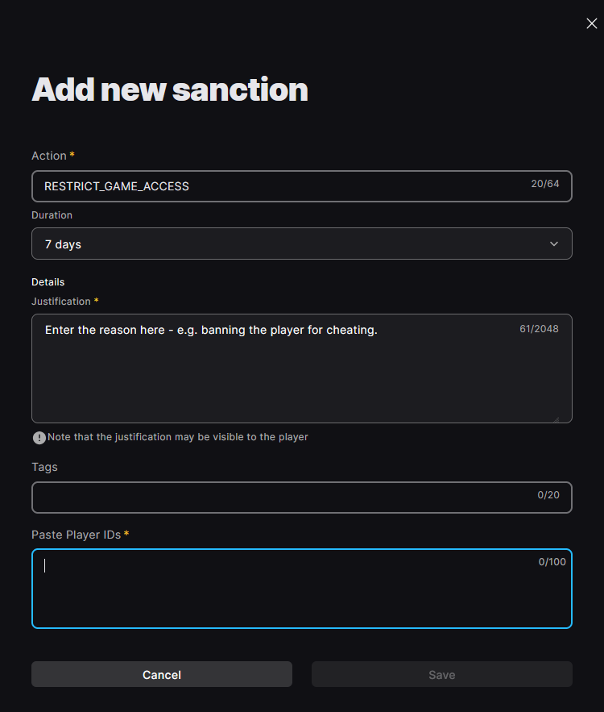

EOS Online Framework provides several network security features, such as automatic encryption and player authentication. These security features are available when:

- When players connect to listen servers hosted by other players over P2P, and/or
- You as the developer are running trusted dedicated servers over IP

Trusted dedicated servers offer the strongest level of security, and prevent players from impersonating other players.

## Turning on network authentication

Network authentication is turned on by default in new projects.

## Listen servers

A server is a listen server when a player is hosting the game through the game client. Connections from other players will happen over EOS P2P.

Users connecting to a listen server are authenticated by checking the EOS P2P sending address. There's no additional configuration required.

Connecting split-screen clients (with multiple local players) to listen servers is not supported when network authentication is turned on. If you're building an online game that also supports split-screen, you'll need to either turn off network authentication or use dedicated servers to host games.

## Dedicated servers

A server is a dedicated server when you are running the dedicated server binary that you built in Unreal Engine. Dedicated servers can be run by either you (the game developer) or players, but only dedicated servers run by you as the game developer can be trusted.

### Setting dedicated server distribution mode

In Project Settings you can specify how you're distributing your dedicated server binaries. It's important that this value matches how you're using dedicated servers in your game, to prevent dedicated server secrets from leaking to players. The options for this setting are:

- **Dedicated server binaries are only ever distributed and run by developers (you)**: Dedicated server secrets, such as the client ID, secret and private key will be embedded into the dedicated server binaries.
- **Both developers and players will run dedicated servers**: Secrets are stored externally in `Build/NoRedist/DedicatedServerEngine.ini`. When you run dedicated servers on your own infrastructure, you must provide these settings at runtime.
- **Dedicated server binaries will be distributed to players and only run by players**: Turns off all trusted dedicated server functionality.

With the first two options, you can separately turn off trusted dedicated servers and the network security features they provide.

### Using automatic encryption on trusted dedicated servers

When a player connects to a trusted dedicated server, the network connection is encrypted with AES-GCM by default. When a player connects to a listen server over P2P, the network connection is encrypted via the WebRTC protocol.

When you open the EOS Project Settings for the first time, the plugin will automatically generate the public/private key pair used for trusted dedicated servers. Automatic encryption on trusted dedicated servers is enabled by default.

If you need to use something other than AES-GCM to encrypt connections over IP, you can turn off "Enable Automatic Encryption on Trusted Dedicated Servers". You will then need to handle setting up encryption yourself. The network security features listed here and Anti-Cheat both require the network connection to be encrypted, so you _must_ set up encryption manually if you turn off automatic encryption.

### Setting dedicated server client IDs and secrets

Your trusted dedicated servers will have their own client ID and secret for Epic Online Services. This allows your dedicated servers to access EOS APIs without signing in as a player.

You should give your game client a policy of `GameClient` and your trusted dedicated servers a policy of `TrustedServer`. This can be configured in the Epic Online Services Developer Portal.

Once you've created a client ID and secret for your dedicated servers, you should set them in Project Settings here:


By setting the dedicated server client ID and secret in Project Settings, this will enable dedicated servers launched in the editor to work correctly.

If your dedicated servers will only be run by you on your trusted infrastructure, you don't need to do anything else; setting the client ID and secret in Project Settings is enough.

:::info
If you're running dedicated game servers on Agones, [Preparing your game server](../../dedis/preparing_your_game_server.mdx#creating-a-client-id-and-secret-for-your-game-server-binaries) has more detailed information on how to set up the client ID and secret on Kubernetes.
:::

If your dedicated servers are being run by both you and players, you'll need to provide the client ID and secret either via environment variables or via the command line when running the dedicated servers on your own infrastructure.

To provide the values on the command line, locate them inside Project Settings and then pass the following additional parameters:

```
-ini:Engine:[EpicOnlineServices]:DedicatedServerClientId=__SERVER_ID__ -ini:Engine:[EpicOnlineServices]:DedicatedServerClientSecret=__SERVER_SECRET__ -ini:Engine:[EpicOnlineServices]:DedicatedServerPrivateKey=__PRIVATE_KEY__
```

To provide the values via environment variables, locate them inside Project Settings and then set the following environment variables:

```
REDPOINT_EOS_DEDICATEDSERVERCLIENTID=__SERVER_ID__
REDPOINT_EOS_DEDICATEDSERVERCLIENTSECRET=__SERVER_SECRET__
REDPOINT_EOS_DEDICATEDSERVERPRIVATEKEY=__PRIVATE_KEY__
```

:::caution
Dedicated servers being run by players currently need to set at least `DedicatedServerClientId` and `DedicatedServerClientSecret` on the command line. You must not provide `DedicatedServerPrivateKey` to players.

You should create a low permission client ID/secret for player run dedicated servers so that your players can run dedicated servers.
:::

## Preventing banned players from connecting to servers

When a player connects to a server, the server will check the EOS sanctions list for any `RESTRICT_GAME_ACCESS` sanctions against the connecting player. If an active `RESTRICT_GAME_ACCESS` sanction is found, the player will not be permitted to connect and the network connection will be closed.

### Enabling sanction checks

Before sanction checks will work, you need to create a custom client policy in the Epic Games Developer Portal and associate it with your game client and server. Specifically, your custom policy must enable the following permissions:

- **Sanctions** -> **findActiveSanctionsForAnyUser**
- **Sanctions** -> **findSanctionsForAnyUser**
- **Sanctions** -> **findAllSanctions**

This permission is not granted by default, so if you try to enable sanction checks with the default policy, players will not be able to connect to any server.

:::note
In previous versions of the plugin you had to enable sanction checks in Project Settings. This is no longer required as sanction checks are always performed when network authentication is turned on.

If the server does not have permission to query sanctions due to missing client policies, it will permit connections and issue a warning to the log.
:::

### Banning players

You can ban players by adding sanctions in the Epic Games portal (under "Player Moderation" -> "Sanctions"). Make sure you set the action to `RESTRICT_GAME_ACCESS`.


