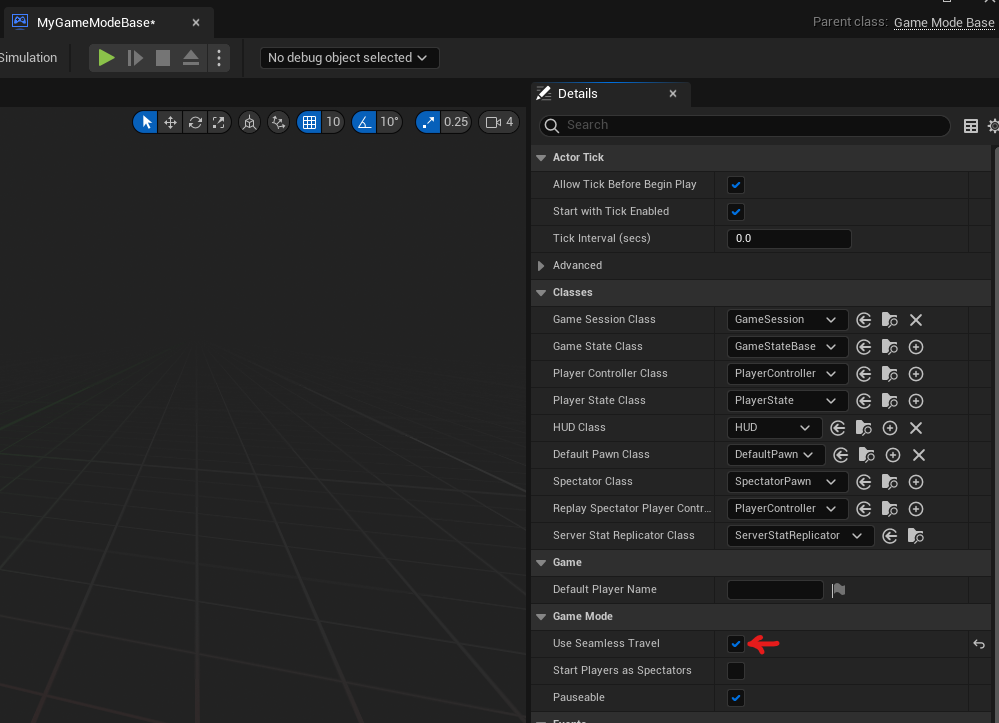

import Tabs from "@theme/Tabs";
import TabItem from "@theme/TabItem";
import Blueprint from "@site/src/Blueprint";

import bpConnect from "./server_travel/connect.bp";
import bpDisconnect from "./server_travel/disconnect.bp";
import bpFailureEvents from "./server_travel/failure_events.bp";
import bpServerTravel from "./server_travel/server_travel.bp";

Once you [retrieve the connection URL and join the session](../../ossv1/sessions/joining.mdx#joining-a-session), you'll need to open a connection to the multiplayer server.

## Connecting to the game server

<Tabs lazy groupId="code-format" defaultValue="c++" values={[ { label: 'C++', value: 'c++' }, { label: 'Blueprints', value: 'blueprints' } ]}>
<TabItem value="c++">

To connect to a game server, use the `GEngine->Browse` function. This assumes that you have the `ConnectInfo` variable populated with the connection string, as demonstrated in [Finding a session](../../ossv1/sessions/finding.mdx#finding-a-session):

```cpp
if (GEngine != nullptr)
{
    FURL NewURL(nullptr, *ConnectInfo, ETravelType::TRAVEL_Absolute);
    FString BrowseError;
    if (GEngine->Browse(GEngine->GetWorldContextFromWorldChecked(this->GetWorld()), NewURL, BrowseError) ==
        EBrowseReturnVal::Failure)
    {
        UE_LOG(LogTemp, Error, TEXT("Failed to start browse: %s"), *BrowseError);
    }
}
```

</TabItem>
<TabItem value="blueprints">

To connect to a game server in blueprints, you can use the "Execute Console Command" blueprint node with a local player controller.

Concatenate the command "open " (note the space) with the connection string to connect to the game server:

<Blueprint height="300px" blueprint={bpConnect} />

</TabItem>
</Tabs>

If the connection fails asynchronously, for example by timing out when connecting to the game server, the error will be sent to the "Network Error" and "Travel Error" events on your Game Instance.

These events are accessible in both C++ and blueprints (without Online Subsystem Blueprints). You should always handle these events if you're building a multiplayer game:

<Blueprint height="350px" blueprint={bpFailureEvents} />

## Disconnecting from a game server

If you're disconnecting from a game server and going back to a single player map (such as the main menu), you can just use the "Open Level" blueprint node:

<Blueprint height="200px" blueprint={bpDisconnect} />

## Performing "server travel" from the server

Your game server might want to bring the currently connected players to a new map. This is called "server travel", because the server is the one initiating the travel to a new map.

:::caution
It is highly recommended that you use seamless travel for travelling to new maps in packaged games. Non-seamless travel is not well maintained by Epic Games, and is broken in Unreal Engine 5.0.
:::

### Turning on seamless travel

<Tabs lazy groupId="code-format" defaultValue="c++" values={[ { label: 'C++', value: 'c++' }, { label: 'Blueprints', value: 'blueprints' } ]}>
<TabItem value="c++">

First, make sure you have seamless travel enabled in your game mode. This must be done on the server:

```cpp
AGameModeBase *GameModeBase = WorldContextObject->GetWorld()->GetAuthGameMode<AGameModeBase>();
if (IsValid(GameModeBase))
{
    GameModeBase->bUseSeamlessTravel = true;
}
```

</TabItem>
<TabItem value="blueprints">

Make sure that you have "Use Seamless Travel" enabled in your game modes:



</TabItem>
</Tabs>

### Travelling to the new map

<Tabs lazy groupId="code-format" defaultValue="c++" values={[ { label: 'C++', value: 'c++' }, { label: 'Blueprints', value: 'blueprints' } ]}>
<TabItem value="c++">

On the server, call the `ServerTravel` function on the current world with the new map name:

```cpp
this->GetWorld()->ServerTravel(TEXT("/Game/MyNewMap"), true);
```

</TabItem>
<TabItem value="blueprints">

On the server, execute the `servertravel` command using "Execute Console Command" blueprint node. You must have at least one player connected or a local player (listen server) in order for this to work, due to the way the "Execute Console Command" blueprint node behaves:

<Blueprint height="240px" blueprint={bpServerTravel} />

</TabItem>
</Tabs>
