Android platforms will authenticate with Google via Google Play by default. You no longer need to be using a source-based version of Unreal Engine, as the plugin now ships it's own implementation of Google authentication instead of relying on the `OnlineSubsystemGoogle` plugin.

## Disable the OnlineSubsystemGooglePlay plugin in your project

The `OnlineSubsystemGooglePlay` conflicts with the Redpoint implementation of Google authentication. You must disable it in your `.uproject` or your Android game will crash at startup.

Open your project's `.uproject` file, and add `OnlineSubsystemGooglePlay` with "Enabled" set to `false`:

```json
{
  "Plugins": [
    {
      "Name": "OnlineSubsystemGooglePlay",
      "Enabled": false,
      "SupportedTargetPlatforms": ["Android"]
    }
  ]
}
```

:::caution
If you need to use Google Play Billing e-commerce, refer to [Purchasing offers](/ossv1/ecom/purchasing.mdx) to initiate in-app purchases on Google Play. The EOS plugin has built-in support for Google Play Billing, so there is no need to have the `OnlineSubsystemGooglePlay` plugin enabled.
:::

## Set up your application in Google Play

This is a complex, multi-step process to set up your application in Google Play. Because some of these settings are specific to the machine you are developing on, you'll need to repeat these steps if you ever start developing the game on a different computer. Unfortunately we're not able to automate any of this process because Google doesn't expose the necessary APIs to do so.

:::danger
Configuring Google authentication is particularly complex, and unfortunately if you make a mistake here, authentication will silently fail with very little information as to the cause of the error.
:::

### Create your app in Google Play

If you haven't done so already, create an application in the Google Play Console:

1. Open the [Google Play Console](https://play.google.com/console/).
2. Click **Create app**.
3. Pick the basic options appropriate for your app. We don't need to do any further set up just yet.

### Set up the OAuth consent screen

You only need to do this once for your application. If it's already configured, you can skip to the next step.

1. Open the [Google Play Console](https://play.google.com/console/).
2. Locate your application in the application list and click **View app**.
3. Navigate to "Play Games Services" -> "Setup and management" -> "Configuration" item in the sidebar, under the "Grow" section.
4. In the top-right of the screen, click **View in Google Cloud Platform**.

You should now see a screen that looks like this:

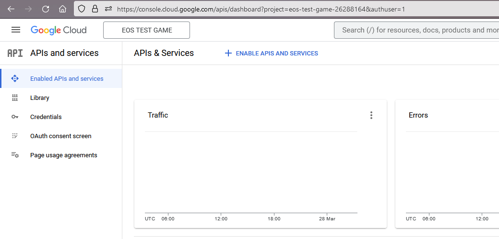

5. Click "OAuth consent screen" on the sidebar.
6. Select "External" as the user type, then click **Create**.
7. Set the "App name" to the same name of the application in Google Play.
8. Set "User support email" to an email address that users can send you messages for support.
9. Fill out the rest of the required information.
10. Click **Save and Continue** at the bottom of the page.
11. On the next page, click **Add or Remove Scopes**.
12. Tick the checkbox next to the `openid` scope, then scroll down and click **Update**. If you can't see the "openid" scope, search for it using the "Enter property name or value" field.
13. Scroll down and click **Save and Continue**.
14. We will publish the OAuth application immediately, so you do not need to configure test users here.
15. Scroll down and click **Save and Continue**.
16. Scroll down and click **Back to Dashboard**.
17. On the OAuth consent screen page, click **Publish App**.
    - If you have configured everything correctly, it should say "You do not need to submit your app for verification."
18. Click **Confirm**.

If you have configured the OAuth consent screen correctly, you should now see something similar to this:

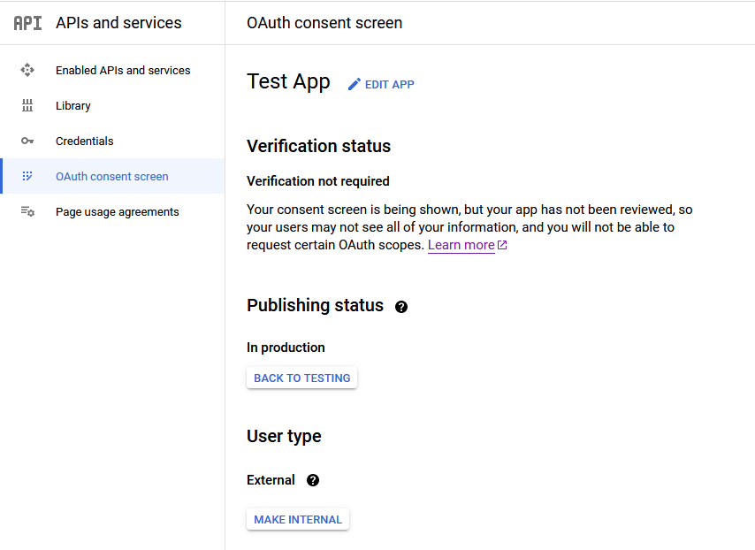

### Gather SHA-1 fingerprints

The SHA-1 fingerprints are used to ensure that only your Android app can use the Google OAuth client. Unfortunately getting the SHA-1 fingerprints is an error-prone process and if you don't have a client set up with the right fingerprints, authentication will silently fail with no further information.

:::danger
You must repeat the step of getting the debug fingerprint for each machine you're developing on.
:::

#### Get the debug fingerprint

At a PowerShell prompt, run the following command:

```powershell
keytool -list -v -keystore "$env:USERPROFILE\.android\debug.keystore" -alias androiddebugkey -storepass android -keypass android 2>$null | Where-Object { $_.Trim().StartsWith("SHA1:") } | ForEach-Object { $_.Trim().Substring(6) }
```

This will give you one or more fingerprints like so:

```
68:D9:91:0E:54:66:61:02:EB:0B:29:37:FE:62:8D:AA:0B:04:65:47
```

Make a note of these fingerprints for later.

#### Get the distribution fingerprint

In your Unreal Engine project settings, you should have a distribution keystore set up for your Android app:

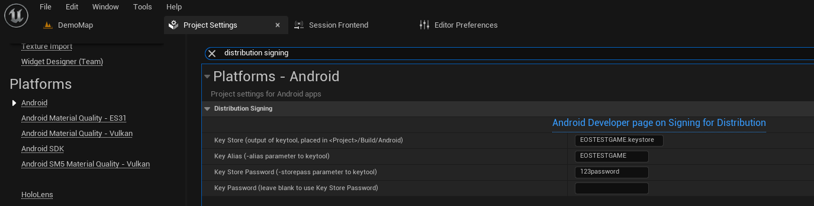

If you do not have a keystore set up for your Android application already, please follow the [Unreal Engine documentation on Signing Projects for Release](https://dev.epicgames.com/documentation/en-us/unreal-engine/signing-android-projects-for-release-on-the-google-play-store-with-unreal-engine/) which will guide you through the process of creating this keystore.

:::note
If you ever regenerate the distribution certificate, you must click **Request upload key reset** under "Setup" -> "App integrity" -> "App signing" tab -> "Request upload key reset". After re-generating a keystore, you'd have to configure fingerprints again. Therefore you should check in your keystore file to source control so you don't lose it.
:::

At a PowerShell prompt, run the following commands, replacing the `C:\Path\To\Your\Project`, `ExampleKey.keystore`, `MyKey` and `123password` values as appropriate.

```powershell
cd C:\Path\To\Your\Project
keytool -list -v -keystore "Build\Android\ExampleKey.keystore" -alias MyKey -storepass 123password 2>$null | Where-Object { $_.Trim().StartsWith("SHA1:") } | ForEach-Object { $_.Trim().Substring(6) }
```

This will give you one or more fingerprints like so:

```
CF:3D:90:C8:CE:C8:DF:58:CF:F8:AC:00:8B:9A:AD:9E:F7:6B:F4:FB
```

Make a note of these fingerprints for later.

#### Get the Google Play app signing key fingerprint

These days, Google Play automatically re-signs your application with a key that they manage when your application is deployed to the Google Play Store. Therefore you _also_ need to get the fingerprint that the application will have when published to the Google Play Store.

1. Open the [Google Play Console](https://play.google.com/console/).
2. Locate your application in the application list and click **View app ->**.
3. Navigate to "Setup" -> "App integrity" item in the sidebar, under the "Release" section.
4. Click on the **App signing** tab.

Under "App signing key certificate", you will see a **SHA-1 certificate fingerprint** that looks like this:

```
CA:F2:00:19:A1:E4:F7:10:B4:88:5C:E9:AA:6A:43:8B:2B:B7:6B:52
```

Make a note of this fingerprint for later.

### Create the OAuth clients for the fingerprints on Google Cloud Platform

You should have collected a list of fingerprints from the previous steps like so:

```
68:D9:91:0E:54:66:61:02:EB:0B:29:37:FE:62:8D:AA:0B:04:65:47
CF:3D:90:C8:CE:C8:DF:58:CF:F8:AC:00:8B:9A:AD:9E:F7:6B:F4:FB
CA:F2:00:19:A1:E4:F7:10:B4:88:5C:E9:AA:6A:43:8B:2B:B7:6B:52
```

:::caution
You must have retrieved at least one fingerprint from each section above. If you have less than 3 fingerprints, you've probably done something wrong and need to repeat the steps above before proceeding!
:::

For each fingerprint, we now need to create an OAuth client in the linked Google Cloud project for the application.

1. Open the [Google Play Console](https://play.google.com/console/).
2. Locate your application in the application list and click **View app**.
3. Navigate to "Play Games Services" -> "Setup and management" -> "Configuration" item in the sidebar, under the "Grow" section.
4. In the top-right of the screen, click **View in Google Cloud Platform**.
5. Click "Credentials" in the sidebar.

Now for **each fingerprint**, you need to perform the following steps:

1. Click **Create Credentials** and pick **OAuth client ID** from the dropdown.
2. Select **Android** as the application type from the dropdown.
3. Set the name to be `<game name> - <fingerprint>` so that you can identify the client later.
4. Set the package name to match what is configured in the Unreal Engine Project Settings.
   - If you need to find it, search for "Android Package Name" in the Unreal Engine Project Settings.
   - Make sure you replace `[PROJECT]` with the project name before you put it into this form.
5. Copy the fingerprint into the SHA-1 certificate fingerprint field.
6. Click **Create**.
7. You will be shown a pop-up that displays the client ID. Copy this client ID and store it for later steps.

After you have completed this process, you should have a client for each fingerprint set up in the credential list like so:

:::caution
You must repeat this process for each fingerprint. Don't remove existing entries either, in case they're used by other developers on your team.
:::

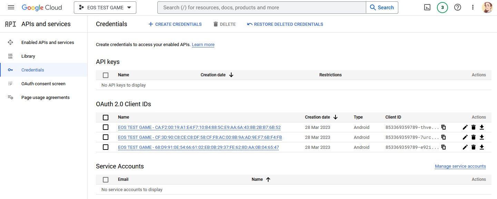

You should also have a list of client IDs, like so:

```
853369359789-thveimh2s0k6rloriq4ej2fkskjra67k.apps.googleusercontent.com
853369359789-7urc9l9mlhqoddftr3ch42tuq7n7keu8.apps.googleusercontent.com
853369359789-e92is61am5u0hr4d870t79u5k0mibbuk.apps.googleusercontent.com
```

Make a note of these for later as we will require them in a moment. If you didn't copy these when creating the credentials, you can copy them from the credential list above by clicking the copy icon in the Client ID column.

### Create the OAuth client for the Epic Online Services backend on Google Cloud Platform

We need one extra OAuth client for the EOS backend itself. You only need to do this once for your application; if it already exists, you can skip this step.

1. Open the [Google Play Console](https://play.google.com/console/).
2. Locate your application in the application list and click **View app**.
3. Navigate to "Play Games Services" -> "Setup and management" -> "Configuration" item in the sidebar, under the "Grow" section.
4. In the top-right of the screen, click **View in Google Cloud Platform**.
5. Click "Credentials" in the sidebar.
6. Click **Create Credentials** and pick **OAuth client ID** from the dropdown.
7. Select **Web application** as the application type from the dropdown.
8. Set an appropriate name such as "EOS Backend".
9. Leave the "Authorised JavaScript origins" and "Authorised redirect URIs" sections blank.
10. Click **Create**.

You will be shown a pop-up that provides a client ID and secret. Make a note of the client ID, as we will use them to configure the EOS backend in a moment.

:::danger
The client ID for the EOS backend should be kept separate from the client IDs for the Android app, as they have different purposes:

- Client IDs for the Android app: These will go in `DefaultEngine.ini` (or `AndroidEngine.ini`).
- Client ID for the EOS backend: These will go in the Epic Online Services developer portal.
  :::

With all the credentials created, you should now see something like this:

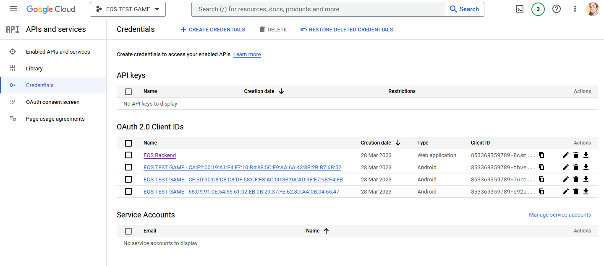

### Connect the OAuth clients in Google Play

Now that we have created our OAuth clients in Google Cloud Platform, we need to go back to Google Play and connect our application to them.

1. Open the [Google Play Console](https://play.google.com/console/).
2. Locate your application in the application list and click **View app**.
3. Navigate to "Play Games Services" -> "Setup and management" -> "Configuration" item in the sidebar, under the "Grow" section.
4. Scroll down to the "Credentials" section.

If you have never connected OAuth clients before, you should currently see something like the following image. Don't delete any clients if they already exist though, since this may impact the application if you've previously published it.

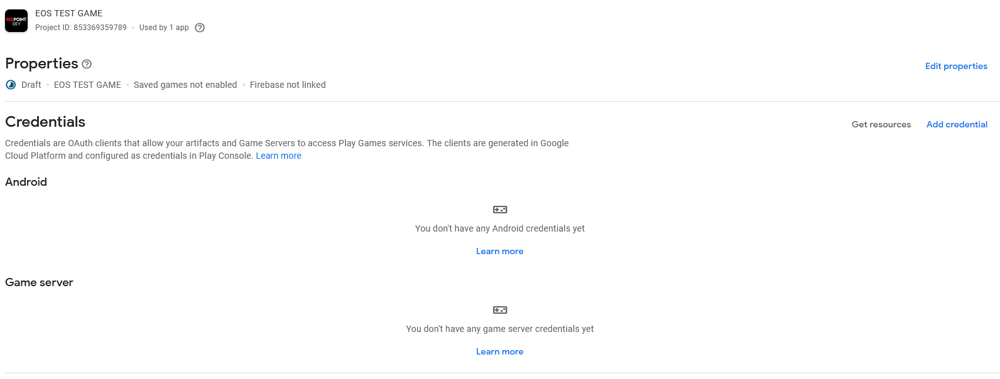

For each of the **Android client IDs** that we got before (there should be at least 3 of them), perform the following steps:

1. Click **Add credential** on the right-hand side of the screen.
2. Select "Android" as the Type if it isn't selected already.
3. For the name, pick one of the following options:
   - If this is the client ID associated with [the Google Play automatic fingerprint](#get-the-google-play-app-signing-key-fingerprint), use the actual name of your game. That's because this is the name that will be presented to players.
   - If this is the client ID associated with one of the other fingerprints, it's recommended that you name it something like `<game> - <start of fingerprint>` to keep the credentials identifable in the credential list, for example `EOS TEST GAME - 68:D9:91:0E:54`. The name is limited to 30 characters, so you might need to shorten the game name to keep it identifiable in this case.
4. If you see the "Use for new installs" option, make sure you tick this if the fingerprint is the Google Play automatic fingerprint.
5. For the "OAuth client", select the appropriate client ID. Since you're associating each credential, you're going to repeat steps 1 through 7 picking a different OAuth client each time.
6. Click **Save changes**.
7. Click **Configuration** in the sidebar to go back to the credential list.

If you have not added the EOS backend credential as a "Game server credential" yet, you also need to add that credential. You only need to do this for your application once:

1. Click **Add credential** on the right-hand side of the screen.
2. Select "Game server" as the Type if it isn't selected already.
3. For the "OAuth client", select the EOS backend OAuth client from the dropdown.
   - If you don't see the correct OAuth client, click **Refresh OAuth clients**.
4. Click **Save changes**.
5. Click **Configuration** in the sidebar to go back to the credential list.

If everything is configured correctly, you should now see the following in Google Play:

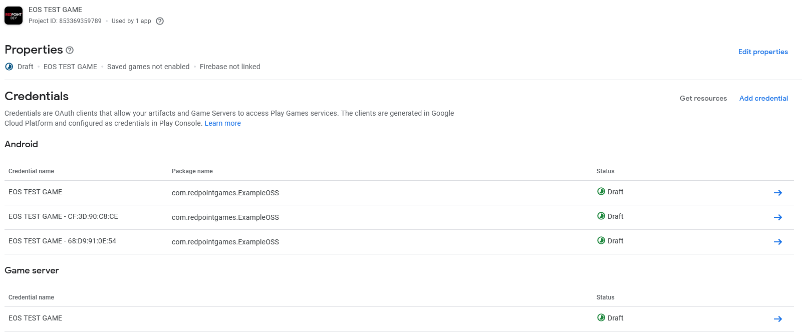

### Finalising set up for Google Play

When you are ready to publish your game on the Google Play store, you will click **Review and publish** in the top right. You don't need to do this now during testing.

:::caution
You must still finish the rest of the guide before authentication will work.
:::

## Set up Google authentication in the Epic Games Dev Portal

1. Open the [Epic Games Dev Portal](https://dev.epicgames.com/).
2. Navigate to your product.
3. Click "Product Settings".
4. Under the "Identity Providers" tab, click "Add Identity Provider".
5. Select "Google" as the identity provider.
6. Set the "Description" to any value you like.
7. Set the "Client ID" to the **client ID for the EOS backend** that you previously got from Google Cloud Platform.
8. Click "Save & Exit".
9. Under the "Environments" tab, click "Identity Providers" next to the Live sandbox.
10. For Google, select the new credential you just made.

## Configuring the Unreal Engine project for Google Play

You now need to configure the Unreal Engine project for Google Play.

### Add the client IDs to your game

In your `DefaultEngine.ini` file (or `AndroidEngine.ini` if you have one), you need to add a `+ClientId=` entry for **each Android client ID you have**, like so:

```ini
[OnlineSubsystemRedpointGoogle]
+ClientId=853369359789-thveimh2s0k6rloriq4ej2fkskjra67k.apps.googleusercontent.com
+ClientId=853369359789-7urc9l9mlhqoddftr3ch42tuq7n7keu8.apps.googleusercontent.com
+ClientId=853369359789-e92is61am5u0hr4d870t79u5k0mibbuk.apps.googleusercontent.com
```

You also need to add the **client ID for the EOS backend** that you previously got from Google Cloud Platform:

```ini
[OnlineSubsystemRedpointGoogle]
ServerClientId=853369359789-0csm4r8p1pg68nfalgh4gambr9qs1u58.apps.googleusercontent.com
```

### Use Google Play authentication at runtime

The Default authentication graph will automatically use Google authentication if your game is launched on Android, so you don't need to explicitly pick Google as the authentication graph.

### Enable Google Play Asset Delivery

In order to publish your game correctly on Google Play, you need to set up your Unreal Engine project to use Google Play Asset Delivery (GooglePAD). If you don't do this, the game won't have the required files to run when installed from Google Play. Android App Bundles no longer support OBB files, and you must publish an initial release to Google Play for authentication to work, so this step is necessary to continue.

- Ensure the "GooglePAD" plugin is enabled in the Plugins window. It's enabled by default, so this will likely already be ticked.
- Enable GooglePAD from the Project Settings. This is **off by default**, so this is something you will need to do. Locate "GooglePAD" under "Plugins" in the sidebar, and then make sure "Enable Plugin" and "Only Distribution" are both ticked. Leave "Only Shipping" unticked:

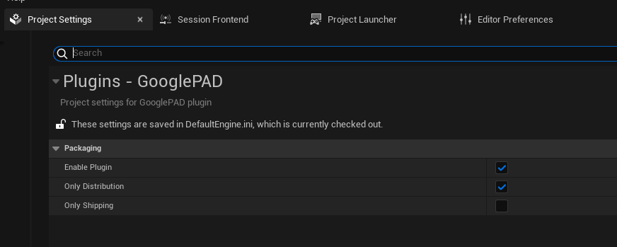

### Enable building in distribution mode

By default Unreal Engine will sign your Android app with the [debug fingerprint](#get-the-debug-fingerprint) and include debug information. To package and upload a release to Google Play however, you need to build the game in "distribution" mode. This will sign your Android app with the [distribution fingerprint](#get-the-distribution-fingerprint) and strip out information that would otherwise make the upload to Google Play fail.

- Open Project Settings
- Under the "Project" -> "Packaging" category, enable "For Distribution":

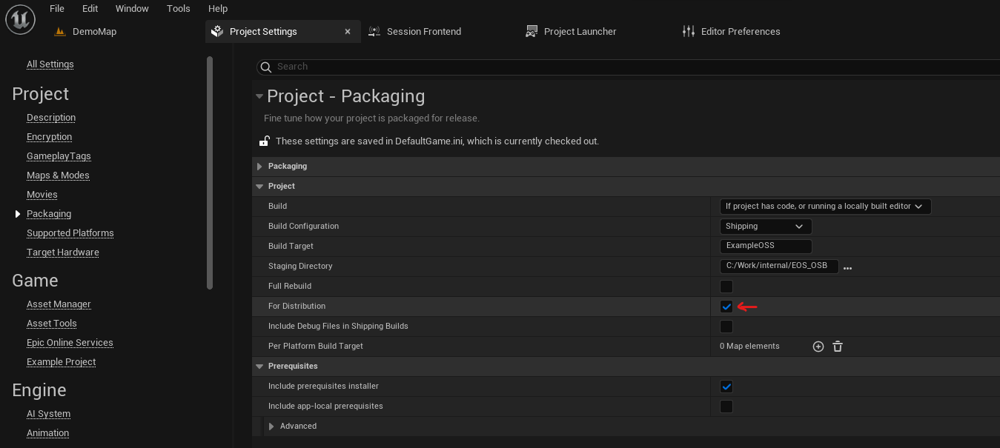

### Enable App Bundles

To upload your game to Google Play, you need to package your Android app into an Android App Bundle (AAB). Ensure that you've enabled App Bundles in Project Settings under "Platforms" -> "Android":

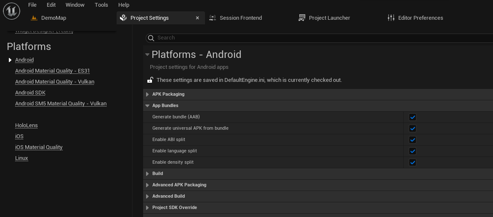

### Set the target SDK version

Google Play requires that the target SDK version is 31 or higher. Update Project Settings and ensure that the Target SDK Version is at least 31:

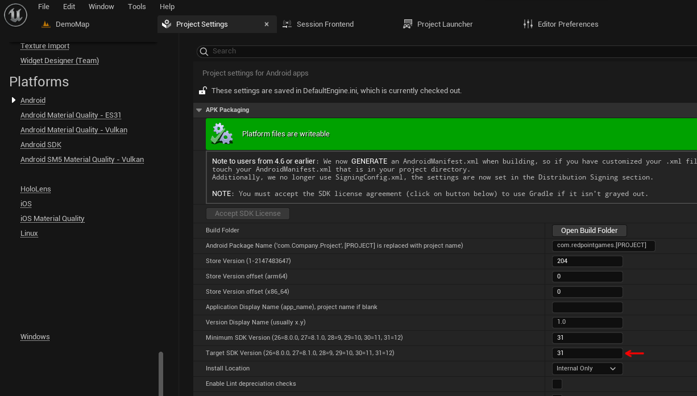

### Package your project and ensure it is packaged correctly

To ensure that your project is packaged correctly for Google Play, package your project for Android via the editor now. You can do this from the "Platforms" dropdown -> "Android" -> "Package Project":

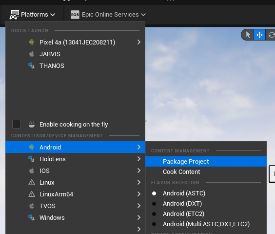

Once your project finishes building, navigate to the directory that you selected as the package output. It is now important to **note the sizes of the files in this directory**:

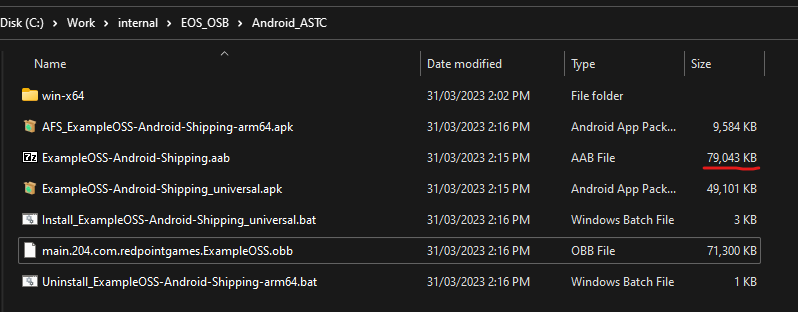

If your game has been packaged for Google Play correctly, the `.aab` file will be larger than the `_universal.apk` file. If they're close to the same size, then [GooglePAD isn't enabled](#enable-google-play-asset-delivery) and the game assets haven't been included in the App Bundle.

### Deploy an initial release

Before you can test in development or via Google Play, you need to deploy an initial release to the Internal testing track in the Google Play console in order for login to work.

1. Open the [Google Play Console](https://play.google.com/console/).
2. Locate your application in the application list and click **View app ->**.
3. Navigate to "Testing" -> "Internal testing" item in the sidebar, under the "Release" section.
4. Click "Create new release" in the top-right of the screen.
5. Click "Upload" and select the `<YourGame>-Android-Shipping.aab` file that Unreal Engine previously built.
6. After your bundle uploads, you should be able to see "App bundle". Click on the arrow on the right-hand side of the screen:

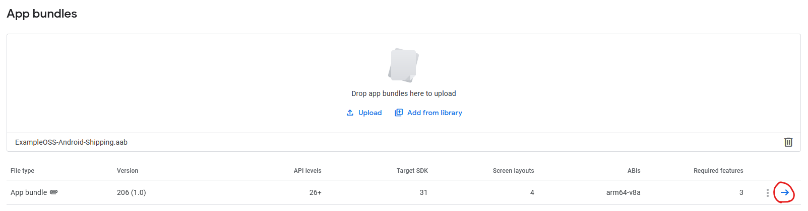

7. Navigate to the "Delivery" tab. You should be able to see both the "base" and "obbassets" entries, like so:

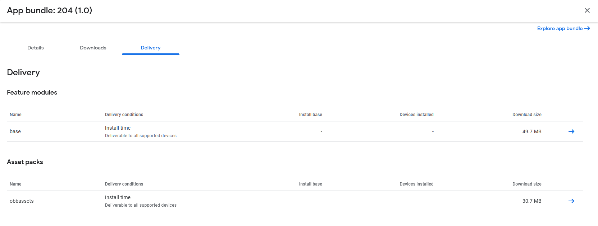

:::caution
If you do not see "obbassets" here, then the bundle is not packaged correctly. Fix up [GooglePAD](#enable-google-play-asset-delivery), repackage the game and then upload it again.
:::

8. Close the app bundle details screen by clicking the **X** in the top-right corner of the dialog.
9. Click **Next** in the bottom-right.
10. Click **Start roll-out to Internal testing** in the bottom-right.
11. Click **Rollout** on the dialog that pops up.
12. If you intend to test by installing the app onto the device via Google Play, it can take 5-10 minutes for a release uploaded via this process to reach the device, so keep in mind you won't see the update straight away. For a faster way of testing during development, launch the game directly onto the device via the Unreal Engine editor.

## Testing Google Play authentication

You can now test Google authentication in one of two ways:

- Launch the game onto the Android device from the Unreal Engine editor.
- On the device you want to test on, enroll in internal testing by going to the URL provided by the Google Play Console. It can be found under "Release" -> "Testing" -> "Internal testing" -> "Testers" tab -> "Copy link". Click "Accept Invite", then click the link to install it from the Google Play store.

## Troubleshooting

If you're having difficulty getting sign in to work, run `adb logcat` to see the logs from the game as you are trying to login. You must provide support with the logs from `adb logcat` for us to help you, otherwise we won't be able to tell what's going wrong.

### Check the SHA-1 fingerprints

The most typical error is that your SHA-1 fingerprints haven't been configured correctly or are missing for the local computer. Make sure you add the debug store's fingerprint for each new machine you develop on, or things won't work right.

### Check app testers list

Ensure that the account you are using to sign in with on the Android device is an approved testing account under "Release" -> "Testing" -> "Internal testing" -> "Testers".

### Check services testers list

_This is a different tester list_. Ensure that the account you are using to sign in with on the Android device is an approved testing account under "Play Games services" -> "Setup and management" -> "Testers" -> "Testers" tab. This is in addition to the internal app testing list that you configured above.

### I get a screen with "File Verification Failed" and a progress bar when my game starts up

You haven't [enabled GooglePAD correctly](#enable-google-play-asset-delivery). This screen will only appear if the game is incorrectly trying to download an OBB file.

### Failed to open descriptor file

If you get a message "Failed to open descriptor file" when launching the game on an Android device from the editor, this can have several causes:

- You have "For Distribution" enabled in the Project Settings. In this scenario:
  1. Turning off "For Distribution". This option must only be used when making a final package for Google Play, and not for on-device testing.
- You have the "Build Configuration" setting set to `Shipping` in Project Settings, or have selected `Shipping` as the configuration for Android via the editor toolbar. In this scenario:
  1. Change the build configuration to `Development`, `DebugGame` or `Debug`. The `Shipping` configuration only works when the game is installed via Google Play, and does not work for on-device testing.
- You previously installed the game to the device via Google Play. In this scenario:
  1. Uninstall the game from the device.
  2. Delete the `Binaries/Android` folder from your project.
  3. Delete the `Intermediate/Android` folder from your project.
  4. On the device, launch the "Files" app. Scroll down and tap on "Internal storage". Delete the following folders if they exist:
     - `obb`
     - `UE4Game`
     - `UnrealGame`
  5. Launch the game again from the editor.
