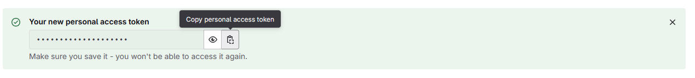

You can get access to features and bug fixes before they're released on Fab by cloning the plugin from our Git repository on GitLab.

This guide assumes you'll be cloning the repository over HTTPS. You can use SSH if you want, but that's outside the scope of this guide.

## Verify your license on the License Manager

Before you can access GitLab, you'll need to upload your receipt to the [License Manager](https://licensing.redpoint.games/) and wait for it to be verified.

## Sign into GitLab

Open the [Redpoint GitLab](https://src.redpoint.games/) and sign into your Redpoint ID. You must sign into the same account that you used to verify your source code access.

## Create an access token

On the [Personal access tokens](https://src.redpoint.games/-/user_settings/personal_access_tokens) page, add a new token.

- Give the token a name like "Git access".
- Clear or set the expiration date far in the future.
- Select the `read_repository` and `write_repository` scopes.
- Click **Create personal access token**.
- Click the copy button and save the token somewhere such as in Notepad.

## View your username

You'll also need your GitLab username. You can find it on the [Account settings](https://src.redpoint.games/-/profile/account) page under "Change username".

## Download a Git client

There are multiple Git clients you can use, including just using the [Git command line](https://git-scm.com/downloads).

Internally at Redpoint we use [Fork](https://git-fork.com/). While it is a commercial product, it does have a free evaluation that you can use.

## Clone the plugin repository

In your Git client, clone the repository:

- URL: `https://src.redpoint.games/redpointgames/eos-online-framework/`
- Use your GitLab username when prompted.
- Use the access token as the password when prompted.

Once the repository has been cloned, you can copy or move the folder to `<Project>\Plugins\EOS` to use it in your project.
