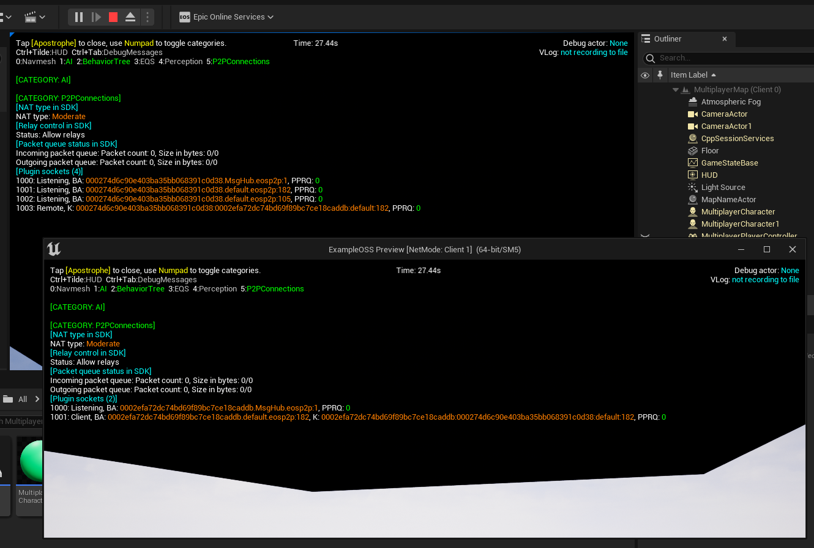

Unreal Engine ships with the [Gameplay Debugger](https://docs.unrealengine.com/5.0/en-US/using-the-gameplay-debugger-in-unreal-engine/) which you can use to view the realtime state of the game in the editor and on-device.

EOS Online Framework extends the gameplay debugger to provide information about the current P2P connections, the NAT type and the packet queue length:

To enable the gameplay debugger, type `enablegdt` in the console. In the editor the console can be accessed by pressing <code>`</code> on your keyboard after starting play-in-editor.
